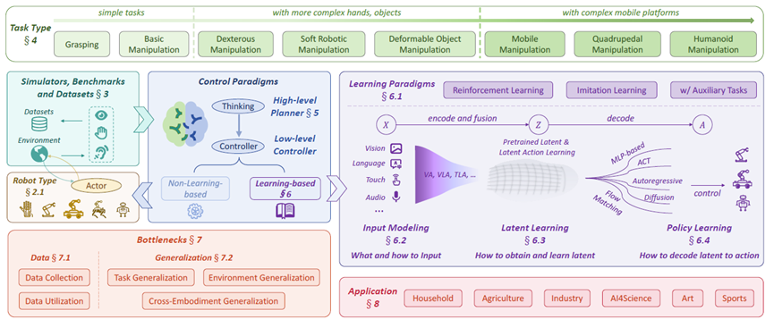

# Awesome-Robotics-Manipulation

## ✨ About

This repository curates research papers on robot manipulation, featuring a smaller collection of non-learning control methods and a larger body of learning-based approaches.

This repository will be continuously updated, and we warmly welcome contributions from the community. If you have papers, projects, or resources that are not yet included, please feel free to submit them via a pull request, open an issue for discussion or [email](baishuanghao@stu.xjtu.edu.cn) us to add papers!


## 📚 Related Surveys

- **Comprehensive Survey:**  
  [Towards a Unified Understanding of Robot Manipulation: A Comprehensive Survey](https://arxiv.org/abs/2510.10903)

- **IEEE Transactions on Robotics (T-RO) Version:**  
  Main paper: [Embodied Robot Manipulation in the Era of Foundation Models: Planning and Learning Perspectives](https://arxiv.org/abs/2512.22983)  
  Supplementary material: [Appendix](documents/T-RO/appendix.pdf)


## 📢 News

- **[2026/08]** 🎉 Our paper [Embodied Robot Manipulation in the Era of Foundation Models: Planning and Learning Perspectives](https://arxiv.org/abs/2512.22983) has been accepted by IEEE Transactions on Robotics (T-RO)!
- **[2026/08]** Released Version 2 of [Towards a Unified Understanding of Robot Manipulation: A Comprehensive Survey](https://arxiv.org/abs/2510.10903). The detailed revision log is available in [arxiv_update_log_v2.md](documents/arxiv_update_log_v2.md).
- **[2026/04]** Updated venue information for most papers and removed a few references without publicly available code. Refined the taxonomy under *High-Level Planning*, separated *Video-Based Planners* into an independent subsection, and are revising the *Motion Planning* section. Added coverage of *Aerial Manipulation* and *Underwater Manipulation*, and improved categories such as *Human Teleoperation* under *Data Collection*.
- **[2025/10]** Our paper [Towards a Unified Understanding of Robot Manipulation: A Comprehensive Survey](https://arxiv.org/abs/2510.10903) is now available!

<details>
<summary><i>Earlier Updates</i></summary>

- **[2025/08]** Major revision of the classification system with a more refined taxonomy; substantial improvements across all sections.
- **[2025/07]** Expanded coverage of **Dexterous**, **Soft Robotic**, **Mobile**, **Quadrupedal**, and **Humanoid Manipulation**; refined the categorization and content for **Awesome Simulators, Benchmarks, and Datasets**; added non-learning-based control methods.
- **[2025/06]** Introduced new sections on **Grasp in Cluttered Scenes**, **Quadrupedal and Humanoid Manipulation**, and **Learning from Human Demonstrations**. Also improved the classification of the **Applications** section and added a subsection on **Embodied QA Datasets**.
- **[2025/02]** Added a new section on **Bimanual Grasp**.
- **[2024/12]** Introduced coverage of **Dexterous Grasp**.
- **[2024/10]** Repository is now public!

</details>


## 📝 Summary of Survey
<details>

<summary>Towards a Unified Understanding of Robot Manipulation: A Comprehensive Survey</summary>

<div style="height:5px;"></div>

This survey presents a unified perspective on robot manipulation by organizing existing methods according to the relationship between **high-level planning** and **low-level action modeling**. We provide a systematic taxonomy that connects different forms of task-level reasoning, structured representations, and executable action generation.

<div align="center">
  
</div>

<b>Summary.</b> The survey first reviews robot manipulation from multiple aspects, including task types, robot embodiments, simulators and benchmarks, high-level planning, learning-based action modeling, applications, and key challenges. This overview provides a comprehensive map of recent advances and highlights the connections among different research directions.

<div align="center">
  
</div>

At the algorithmic level, we formulate robot manipulation as a two-stage process consisting of **high-level planning** and **low-level action modeling**. High-level planning focuses on generating structured intermediate representations, such as task plans, geometric constraints, affordances, code, video predictions, and 3D representations. These structured outputs can be instantiated as constraints or inputs for low-level action models, which generate executable robot actions.

For learning-based action modeling, we further organize existing methods into three fundamental components:
**input modeling**, which studies what sensory modalities are used and how they are represented; **latent learning**, which explores how intermediate representations or latent actions are learned; and **policy learning**, which investigates how actions are generated from learned representations.

<div align="center">
  
</div>

<b>Literature Distribution.</b> The survey covers a broad range of literature from major robotics, machine learning, and computer vision venues. The collected papers are mainly published in leading conferences and journals, including CoRL, ICRA, RSS, IROS, NeurIPS, ICLR, CVPR, ICML, IEEE RA-L, IEEE T-RO, IJRR, and other representative venues.

<div align="center">
  
</div>

<b>Word Cloud.</b> The keyword analysis summarizes major research trends in robot manipulation, highlighting emerging topics such as imitation learning, reinforcement learning, vision-language-action models, diffusion policies, dexterous manipulation, grasping, world models, and generalization.

</details>


<!-- ------- 0 - Content Table ------- -->
<h2 id="table-of-contents">🏠 Table of Contents</h2>

- [📝 Awesome Papers](#-awesome-papers)
  - [📄 Survey](#-survey)
  - [Manipulation Tasks](contents/manipulation_tasks.md)
    - [Grasp](contents/manipulation_tasks.md#grasp)
    - [Basic Manipulation](contents/manipulation_tasks.md#basic-manipulation)
    - [Dexterous Manipulation](contents/manipulation_tasks.md#dexterous-manipulation)
    - [Soft Robotic Manipulation](contents/manipulation_tasks.md#soft-robotic-manipulation)
    - [Deformable Object Manipulation](contents/manipulation_tasks.md#deformable-object-manipulation)
    - [Mobile Manipulation](contents/manipulation_tasks.md#mobile-manipulation)
    - [Quadrupedal Manipulation](contents/manipulation_tasks.md#quadrupedal-manipulation)
    - [Humanoid Manipulation](contents/manipulation_tasks.md#humanoid-manipulation)
    - [Aerial Manipulation](contents/manipulation_tasks.md#aerial-manipulation)
    - [Underwater Manipulation](contents/manipulation_tasks.md#underwater-manipulation)
  - [High-level Structured Planning](contents/high-level_structured_planning.md)
    - [Task Planning](contents/high-level_structured_planning.md#task-planning)
    - [Programmatic Planning](contents/high-level_structured_planning.md#programmatic-planning)
    - [Multimodal Reasoning](contents/high-level_structured_planning.md#multimodal-reasoning)
    - [Geometric Constraint-based Planning](contents/high-level_structured_planning.md#geometric-constraint-based-planning)
    - [3D Representation-based Planning](contents/high-level_structured_planning.md#3d-representation-based-planning)
    - [Video-based Planning](contents/high-level_structured_planning.md#video-based-planning)
  - [Low-level Learning-based Action Modeling](contents/low-level_learning-based_action_modeling.md)
    - [Learning Strategy](contents/low-level_learning-based_action_modeling.md#learning-strategy)
      - [Imitation Learning (IL)](contents/low-level_learning-based_action_modeling.md#imitation-learning-il)
      - [Reinforcement Learning (RL)](contents/low-level_learning-based_action_modeling.md#reinforcement-learning-rl)
      - [RL and IL](contents/low-level_learning-based_action_modeling.md#rl-and-il)
      - [Learning with Auxiliary Tasks](contents/low-level_learning-based_action_modeling.md#learning-with-auxiliary-tasks)
    - [Input Modeling](contents/low-level_learning-based_action_modeling.md#input-modeling)
      - [Vision Action Models](contents/low-level_learning-based_action_modeling.md#vision-action-models)
      - [Vision Language Action Models](contents/low-level_learning-based_action_modeling.md#vision-language-action-models)
      - [Tactile-based Action Models](contents/low-level_learning-based_action_modeling.md#tactile-based-action-models)
      - [Other Modalities](contents/low-level_learning-based_action_modeling.md#other-modalities)
    - [Latent Learning](contents/low-level_learning-based_action_modeling.md#latent-learning)
      - [Pretrained Latent Learning](contents/low-level_learning-based_action_modeling.md#pretrained-latent-learning)
      - [Latent Action Learning](contents/low-level_learning-based_action_modeling.md#latent-action-learning)
    - [Policy Learning](contents/low-level_learning-based_action_modeling.md#policy-learning)
      - [Diffusion Policy](contents/low-level_learning-based_action_modeling.md#diffusion-policy)
      - [Flow Matching Policy](contents/low-level_learning-based_action_modeling.md#flow-matching-policy)
      - [Other Policies](contents/low-level_learning-based_action_modeling.md#other-policies)
  - [Bottlenecks](contents/bottlenecks.md)
    - [Data Collection and Utilization](contents/bottlenecks.md#data-collection-and-utilization)
        - [Data Collection](contents/bottlenecks.md#data-collection)
        - [Data Utilization](contents/bottlenecks.md#data-utilization)
    - [Generalization](contents/bottlenecks.md#generalization)
      - [Task Generalization](contents/bottlenecks.md#task-generalization)
      - [Environment Generalization](contents/bottlenecks.md#environment-generalization)
      - [Cross-Embodiment Generalization](contents/bottlenecks.md#cross-embodiment-generalization)
  - [Applications](contents/applications.md)
- [📊 Awesome Simulators, Benchmarks and Datasets](#-awesome-simulators-benchmarks-and-datasets)
  - [Grasp Datasets](#grasp-datasets)
  - [Single-Embodiment Manipulation Simulators and Benchmarks](#single-embodiment-manipulation-simulators-and-benchmarks)
  - [Cross-Embodiment Simulators and Benchmarks](#cross-embodiment-simulators-and-benchmarks)
  - [Other Simulators and Benchmarks](#other-simulators-and-benchmarks)
  - [Trajectory Datasets](#trajectory-datasets)
  - [Embodied QA and Affordance Datasets](#embodied-qa-and-affordance-datasets)
  - [Human and Robotic Video Benchmarks and Datasets](#human-and-robotic-video-benchmarks-and-datasets)
- [🛠️ Awesome Techniques](#-awesome-techniques)
  - [Tutorial](#tutorial)
  - [GitHub Repo](#github-repo)


<!-- ------- 1 - Papers ------- -->
## 📑 Awesome Papers

<!-- ------- 1.1 - Survey ------- -->
### 📄 Survey
|  Title  |   Venue  |   Date   |   Code   |   Notes  |
|:--------|:--------:|:--------:|:--------:|:--------:|
| _VLA Models_ |
| [**Vision-Language-Action Safety: Threats, Challenges, Evaluations, and Mechanisms**](https://arxiv.org/abs/2604.23775) | arXiv | 2026-04-26 |  [GitHub](https://github.com/LiQiiiii/Awesome-VLA-Safety) | VLA + Robustness |
| [**Vision-Language-Action in Robotics: A Survey of Datasets, Benchmarks, and Data Engines**](https://arxiv.org/abs/2604.23001) | TMLR 2026 | 2026-04-24 |  [GitHub](https://github.com/ziyaow1010/vla-datasets-benchmarks) | VLA + Data |
| [**An Anatomy of Vision-Language-Action Models: From Modules to Milestones and Challenges**](https://arxiv.org/abs/2512.11362) | arXiv | 2025-12-12 |  [GitHub](https://github.com/SuyuZ1/VLA-Survey-Anatomy) | VLA |
| [**A Survey on Efficient Vision-Language-Action Models**](https://arxiv.org/abs/2510.24795) | arXiv | 2025-10-27 |  [GitHub](https://github.com/YuZhaoshu/Efficient-VLAs-Survey) | VLA Models + Efficiency |
| [**Efficient Vision-Language-Action Models for Embodied Manipulation: A Systematic Survey**](https://arxiv.org/abs/2510.17111) | arXiv | 2025-10-20 | - | VLA + Efficiency |
| [**Vision-Language-Action Models for Robotics: A Review Towards Real-World Applications**](https://arxiv.org/abs/2510.07077) | IEEE Access 2025 | 2025-10-08 | [Project](https://vla-survey.github.io/) | VLA |
| [**Large VLM-based Vision-Language-Action Models for Robotic Manipulation: A Survey**](https://arxiv.org/abs/2508.13073) | arXiv | 2025-08-23 |  [GitHub](https://github.com/JiuTian-VL/Large-VLM-based-VLA-for-Robotic-Manipulation) | VLA |
| [**Survey of Vision-Language-Action Models for Embodied Manipulation**](https://arxiv.org/abs/2508.15201) | arXiv | 2025-08-21 | - | VLA |
| [**Vision Language Action Models in Robotic Manipulation: A Systematic Review**](https://arxiv.org/abs/2507.10672) | arXiv | 2025-07-14 | - | VLA |
| [**A Survey on Vision-Language-Action Models: An Action Tokenization Perspective**](https://arxiv.org/abs/2507.01925) | arXiv | 2025-07-02 | - | VLA |
| [**Parallels Between VLA Model Post-Training and Human Motor Learning: Progress, Challenges, and Trends**](https://arxiv.org/abs/2506.20966) | arXiv | 2025-05-26 |  [GitHub](https://github.com/AoqunJin/Awesome-VLA-Post-Training) | VLA |
| [**Vision-Language-Action Models: Concepts, Progress, Applications and Challenges**](https://arxiv.org/abs/2505.04769) | arXiv | 2025-05-07 | - | VLA |
| [**A Survey on Vision-Language-Action Models for Embodied AI**](https://arxiv.org/abs/2405.14093) | TNNLS 2026 | 2024-05-23 | - | VLA |
| _World Model_|
| [**Toward Unified Robot Learning: Bridging Representation, Vision-Language-Action, and World Models**](https://arxiv.org/abs/2609.03927) | arXiv | 2026-09-03 | - | World Model |
| [**From World Action Models to Embodied Brains: A Roadmap for Open-World Physical Intelligence**](https://arxiv.org/abs/2607.11689) | arXiv | 2026-07-13 | - | World Model |
| [**A Definition and Roadmap for World Models**](https://arxiv.org/abs/2607.06401) | arXiv | 2026-07-07 | - | World Model |
| [**World Models for Robotic Manipulation: A Survey**](https://arxiv.org/abs/2606.00113) | arXiv | 2026-05-27 | - | World Model |
| [**World Action Models: The Next Frontier in Embodied AI**](https://arxiv.org/abs/2605.12090) | arXiv | 2026-05-12 |  [GitHub](https://github.com/OpenMOSS/Awesome-WAM) | World Model |
| [**World Model for Robot Learning: A Comprehensive Survey**](https://arxiv.org/abs/2605.00080) | IJRR 2026 | 2026-04-30 |  [GitHub](https://github.com/NTUMARS/Awesome-World-Model-for-Robotics-Policy) | World Model |
| [**A Step Toward World Models: A Survey on Robotic Manipulation**](https://arxiv.org/abs/2511.02097) | arXiv | 2025-10-31 | - | World Model |
| _Manipulation_ |
| [**Data Pyramid for Embodied Manipulation**](https://arxiv.org/abs/2607.24744) | arXiv | 2026-07-27 |  [GitHub](https://github.com/worldbench/awesome-embodied-data-pyramid) | Data |
| [**3D Generation for Embodied AI and Robotic Simulation: A Survey**](https://arxiv.org/abs/2604.26509) | arXiv | 2026-04-29 | - | 3D |
| [**Embodied Robot Manipulation in the Era of Foundation Models: Planning and Learning Perspectives**](https://arxiv.org/abs/2512.22983) | T-RO 2026 | 2025-12-28 |  [GitHub](https://github.com/BaiShuanghao/Awesome-Robotics-Manipulation) | Manipulation |
| [**Towards a Unified Understanding of Robot Manipulation: A Comprehensive Survey**](https://arxiv.org/abs/2510.10903) | arXiv | 2025-10-13 |  [GitHub](https://github.com/BaiShuanghao/Awesome-Robotics-Manipulation) | Manipulation |
| [**A Survey of Robotic Navigation and Manipulation with Physics Simulators in the Era of Embodied AI**](https://arxiv.org/abs/2505.01458) | arXiv | 2025-05-01 | - | Navigation and Manipulation |
| [**Diffusion Models for Robotic Manipulation: A Survey**](https://arxiv.org/abs/2504.08438) | arXiv | 2025-04-11 | - | Manipulation + DP |
| [**Generative Artificial Intelligence in Robotic Manipulation: A Survey**](https://arxiv.org/abs/2503.03464) | arXiv | 2025-03-05 |  [GitHub](https://github.com/GAI4Manipulation/AwesomeGAIManipulation) | Manipulation + Generative Models |
| [**A Survey of Embodied Learning for Object-Centric Robotic Manipulation**](https://arxiv.org/abs/2408.11537) | MIR 2025 | 2024-08-21 |  [GitHub](https://github.com/RayYoh/OCRM_survey) | Manipulation + Object-Centric |
| [**Language-conditioned Learning for Robotic Manipulation: A Survey**](https://arxiv.org/abs/2312.10807) | arXiv | 2023-12-17 |  [GitHub](https://github.com/hk-zh/language-conditioned-robot-manipulation-models) | Manipulation |
| _Dexterous Manipulation_ |
| [**The Developments and Challenges towards Dexterous and Embodied Robotic Manipulation: A Survey**](https://arxiv.org/abs/2507.11840) | RAM 2025 | 2025-07-16 | - | Dexterous Manipulation |
| [**Interactive Imitation Learning for Dexterous Robotic Manipulation: Challenges and Perspectives -- A Survey**](https://arxiv.org/abs/2506.00098) | arXiv | 2025-06-30 | - | Dexterous Manipulation |
| [**Dexterous Manipulation through Imitation Learning: A Survey**](https://arxiv.org/abs/2504.03515) | arXiv | 2025-04-04 | - | Dexterous Manipulation |
| _Deformable Object Manipulation (DOM)_ |
| [**T-DOM: A Taxonomy for Robotic Manipulation of Deformable Objects**](https://arxiv.org/abs/2412.20998) | arXiv | 2024-12-30 | [Project](https://sites.google.com/view/t-dom) | DOM |
| [**A Survey on Robotic Manipulation of Deformable Objects: Recent Advances, Open Challenges and New Frontiers**](https://arxiv.org/abs/2312.10419) | arXiv | 2023-12-16 | - | DOM |
| [**Robotic manipulation and sensing of deformable objects in domestic and industrial applications: a survey**](https://uca.hal.science/hal-01816189/document) | IJRR 2018 | 2018-06-13 | - | DOM |
| _Humanoid Manipulation_ |
| [**Humanoid Locomotion and Manipulation: Current Progress and Challenges in Control, Planning, and Learning**](https://arxiv.org/abs/2501.02116) | TMECH 2025 | 2025-01-03 | - | Humanoid Manipulation |
| [**Teleoperation of Humanoid Robots: A Survey**](https://arxiv.org/abs/2301.04317) | T-RO 2024 | 2023-01-11 | [Project](https://humanoid-teleoperation.github.io/) | Humanoid |
| _Others_ |
| [**No Free Checker: A Survey of Verifiers for Robot Policies**](https://arxiv.org/abs/2609.09250) | arXiv | 2026-09-08 |  [GitHub](https://github.com/ZJUSCL/Awesome-Robot-Verifier) | Robustness |
| [**Progress Reward Modeling for Robotic Learning: A Comprehensive Survey**](https://arxiv.org/abs/2607.21655) | arXiv | 2026-07-22 |  [GitHub](https://github.com/sterzhang/Awesome-Progress-Models) | Data |
| [**Robot Learning from Human Videos: A Survey**](https://arxiv.org/abs/2604.27621) | arXiv | 2026-04-30 |  [GitHub](https://github.com/IRMVLab/awesome-robot-learning-from-human-videos) | Video |
| [**Foundation Models in Robotics: A Comprehensive Review of Methods, Models, Datasets, Challenges and Future Research Directions**](https://arxiv.org/abs/2604.15395) | arXiv | 2026-04-16 | - | Robotics |
| [**From Video to Control: A Survey of Learning Manipulation Interfaces from Temporal Visual Data**](https://arxiv.org/abs/2604.04974) | arXiv | 2026-04-04 | - | Video |
| [**Safety in Embodied AI: A Survey of Risks, Attacks, and Defenses**](https://arxiv.org/abs/2605.02900) | arXiv | 2026-03-28 |  [GitHub](https://github.com/x-zheng16/Awesome-Embodied-AI-Safety) | Embodied + Safety |
| [**Toward Generalist Neural Motion Planners for Robotic Manipulators: Challenges and Opportunities**](https://arxiv.org/abs/2603.24318) | TASE 2026 | 2026-03-25 |  [GitHub](https://github.com/DavoodSZ/DeepLearning-MotionPlanning-Manipulators) | Motion Planning |
| [**Video Generation Models in Robotics -- Applications, Research Challenges, Future Directions**](https://arxiv.org/abs/2601.07823) | arXiv | 2026-01-12 | - | Video Generation |
| [**Safe Learning for Contact-Rich Robot Tasks: A Survey from Classical Learning-Based Methods to Safe Foundation Models**](https://arxiv.org/abs/2512.11908) | arXiv | 2025-12-10 | - | Contact-Rich Manipulation |
| [**Multimodal Fusion and Vision-Language Models: A Survey for Robot Vision**](https://arxiv.org/abs/2504.02477) | arXiv | 2025-04-03 |  [GitHub](https://github.com/Xiaofeng-Han-Res/MF-RV) | Robot Vision |
| [**Aligning Cyber Space with Physical World: A Comprehensive Survey on Embodied AI**](https://arxiv.org/abs/2407.06886) | arXiv | 2024-07-09 |  [GitHub](https://github.com/HCPLab-SYSU/Embodied_AI_Paper_List) | Embodied Agent |
| [**Survey of Learning-based Approaches for Robotic In-Hand Manipulation**](https://arxiv.org/abs/2401.07915) | arXiv | 2024-01-15 | - | In-hand Manipulation |
| [**Deep Learning Approaches to Grasp Synthesis: A Review**](https://arxiv.org/abs/2207.02556) | T-RO 2023 | 2023-07-06 | [Project](https://rhys-newbury.github.io/projects/6dof/) | Grasp |
| [**A Survey of Wheeled Mobile Manipulation: A Decision Making Perspective**](https://par.nsf.gov/servlets/purl/10393722) | J. Mech. Robot. 2023 | 2023-04 | - | Mobile Manipulation |
| [**A Review of Soft Manipulator Research, Applications, and Opportunities**](https://onlinelibrary.wiley.com/doi/abs/10.1002/rob.22051) | J Field Robot. 2023 | 2023-04 | - | Soft Manipulator |

<p align="right">(<a href="#table-of-contents">back to top</a>)</p>

<!-- ------- 1.2 - Future Direction ------- -->
<!-- ### Future Direction
<!-- |  Title  |   Venue  |   Date   |   Code   | 
|:--------|:--------:|:--------:|:--------:|
| [**Federated Learning for Large-Scale Cloud Robotic Manipulation: Opportunities and Challenges**](https://www.arxiv.org/abs/2507.17903) | ICMLC 2025 | 2025-07-23 | - | | --> 

> **Note:** Other papers are **summarized** in the [**Contents**](contents/).


<!-- ------- 2 - Benchmarks ------- -->
## 📊 Awesome Simulators, Benchmarks and Datasets

<!-- ------- 2.1 - Grasp Datasets ------- -->
### Grasp Datasets
<!-- |  Title  |   Venue  |   Date   |   Code   |   Notes  |
|:--------|:--------:|:--------:|:--------:|:--------:| -->
|  Title  |   Venue  |   Date   |   Code   | 
|:--------|:--------:|:--------:|:--------:|
| _Rectangle-based Grasp_ |
| [**Beyond Visual Grasping: Benchmarking Complex Grasping from Detection to Execution**](https://arxiv.org/abs/2607.14341) | IROS 2026 | 2026-07-15 | [Project](https://airvlab.github.io/GCA-Bench/) |  |
| [**RealVLG-R1: A Large-Scale Real-World Visual-Language Grounding Benchmark for Robotic Perception and Manipulation**](https://arxiv.org/abs/2603.14880) | CVPR 2026 | 2026-03-16 |  [GitHub](https://github.com/lif314/RealVLG-R1) |  |
| [Grasp-Anything-6D: **Language-Driven 6-DoF Grasp Detection Using Negative Prompt Guidance**](https://arxiv.org/abs/2407.13842) | ECCV 2024 | 2024-07-18 |  [GitHub](https://github.com/Fsoft-AIC/Language-Driven-6-DoF-Grasp-Detection-Using-Negative-Prompt-Guidance) |  |
| [Grasp-Anything++: **Language-driven Grasp Detection**](https://arxiv.org/abs/2406.09489) | CVPR 2024 | 2024-06-13 |  [GitHub](https://github.com/Fsoft-AIC/LGD) |  |
| [**Grasp-Anything: Large-scale Grasp Dataset from Foundation Models**](https://arxiv.org/abs/2309.09818) | ICRA 2024 | 2023-09-18 |  [GitHub](https://github.com/Fsoft-AIC/Grasp-Anything) | |
| [**REGRAD: A Large-Scale Relational Grasp Dataset for Safe and Object-Specific Robotic Grasping in Clutter**](https://arxiv.org/abs/2104.14118) | ICRA 2021 | 2021-04-29 |  [GitHub](https://github.com/poisonwine/REGRAD) | |
| [**Jacquard: A Large Scale Dataset for Robotic Grasp Detection**](https://arxiv.org/abs/1803.11469) | IROS 2018 | 2018-03-30 | [Project](https://jacquard.liris.cnrs.fr/) | |
| [Cornell: **Efficient Grasping from RGBD Images: Learning Using a New Rectangle Representation**](https://ieeexplore.ieee.org/document/5980145) | ICRA 2011 | 2011-08 | - | |
| _6-DoF Grasp_ |
| [**GraspFactory: A Large Object-Centric Grasping Dataset**](https://arxiv.org/abs/2509.20550) | CoRLW 2025 | 2025-09-24 |  [GitHub](https://github.com/AutodeskRoboticsLab/graspfactory) | |
| [**MapleGrasp: Mask-guided Feature Pooling for Language-driven Efficient Robotic Grasping**](https://arxiv.org/abs/2506.06535) | WACV 2026 | 2025-06-06 | - | |
| [**GraspClutter6D: A Large-scale Real-world Dataset for Robust Perception and Grasping in Cluttered Scenes**](https://arxiv.org/abs/2504.06866) | RA-L 2025 | 2025-04-09 | [Project](https://sites.google.com/view/graspclutter6d) | |
| [**QDGset: A Large Scale Grasping Dataset Generated with Quality-Diversity**](https://arxiv.org/abs/2410.02319) | ICRA 2025 | 2024-10-03 | [Project](https://github.com/qdgrasp/qdgrasp.github.io/blob/main/qdg_set.md) | |
| [**Real-to-Sim Grasp: Rethinking the Gap between Simulation and Real World in Grasp Detection**](https://arxiv.org/abs/2410.06521) | CoRL 2024 | 2024-10-09 | [Project](https://isee-laboratory.github.io/R2SGrasp/) | |
| [**MetaGraspNetV2: All-in-One Dataset Enabling Fast and Reliable Robotic Bin Picking via Object Relationship Reasoning and Dexterous Grasping**](https://ieeexplore.ieee.org/document/10309974) | TASE 2023 | 2023-11-06 |  [GitHub](https://github.com/maximiliangilles/MetaGraspNet) | |
| [**MetaGraspNet: A Large-Scale Benchmark Dataset for Scene-Aware Ambidextrous Bin Picking via Physics-based Metaverse Synthesis**](https://arxiv.org/abs/2208.03963) | CASE 2022 | 2022-08-08 |  [GitHub](https://github.com/maximiliangilles/MetaGraspNet) | |
| [**ACRONYM: A Large-Scale Grasp Dataset Based on Simulation**](https://arxiv.org/abs/2011.09584) | ICRA 2021 | 2020-11-18 |  [GitHub](https://github.com/NVlabs/acronym) | |
| [**GraspNet-1Billion: A Large-Scale Benchmark for General Object Grasping**](https://openaccess.thecvf.com/content_CVPR_2020/papers/Fang_GraspNet-1Billion_A_Large-Scale_Benchmark_for_General_Object_Grasping_CVPR_2020_paper.pdf) | CVPR 2020 | 2020-08-05 |  [GitHub](https://github.com/graspnet/graspnet-baseline) | |
| _Dexterous Grasp_ |
| [**HRDexDB: A Large-Scale Dataset of Dexterous Human and Robotic Hand Grasps**](https://arxiv.org/abs/2604.14944) | arXiv | 2026-04-16 | [Project](https://snuvclab.github.io/HRDexDB/) | |
| [**Dex1B: Learning with 1B Demonstrations for Dexterous Manipulation**](https://arxiv.org/abs/2506.17198) | RSS 2025 | 2025-06-20 | [Project](https://jianglongye.com/dex1b/) | |
| [**DexGraspNet 2.0: Learning Generative Dexterous Grasping in Large-scale Synthetic Cluttered Scenes**](https://openreview.net/attachment?id=5W0iZR9J7h&name=pdf) | CoRL 2024 | 2024 |  [GitHub](https://github.com/PKU-EPIC/DexGraspNet2)  |
| [**UniFucGrasp: Human-Hand-Inspired Unified Functional Grasp Annotation Strategy and Dataset for Diverse Dexterous Hands**](https://www.arxiv.org/abs/2508.03339) | RA-L 2025 | 2025-08-05 |  [GitHub](https://github.com/cxcAxxy/UniFucGrasp) | |
| [**DexGraspNet: A Large-Scale Robotic Dexterous Grasp Dataset for General Objects Based on Simulation**](https://arxiv.org/abs/2210.02697) | ICRA 2023 | 2022-10-06 |  [GitHub](https://github.com/PKU-EPIC/DexGraspNet) | |

<p align="right">(<a href="#table-of-contents">back to top</a>)</p>

<!-- ------- 2.2 - Single-Embodiment Manipulation Simulators and Benchmarks ------- -->

<div align="center">

### Single-Embodiment Manipulation Simulators and Benchmarks

</div>

### Basic Manipulation with a Single Arm
<!-- |  Title  |   Venue  |   Date   |   Code   |   Notes  |
|:--------|:--------:|:--------:|:--------:|:--------:| -->
|  Title  |   Venue  |   Date   |   Code   | 
|:--------|:--------:|:--------:|:--------:|
| [**IMBench: A Benchmark for Intuitive Robotic Manipulation**](https://arxiv.org/abs/2607.15641) | RSSW 2026 | 2026-07-17 | [Project](https://imbench.org/) | |
| [**Toward Visually Realistic Simulation: A Benchmark for Evaluating Robot Manipulation in Simulation**](https://arxiv.org/abs/2605.06311) | arXiv | 2026-05-07 | - | |
| [WorldComposer: **From Seeing to Simulating: Generative High-Fidelity Simulation with Digital Cousins for Generalizable Robot Learning and Evaluation**](https://arxiv.org/abs/2604.15805) | arXiv | 2026-04-17 |  [GitHub](https://github.com/jaber628/WorldComposer) | |
| [**RoboLab: A High-Fidelity Simulation Benchmark for Analysis of Task Generalist Policies**](https://arxiv.org/abs/2604.09860) | arXiv | 2026-04-10 | - | |
| [**REALM: A Real-to-Sim Validated Benchmark for Generalization in Robotic Manipulation**](https://arxiv.org/abs/2512.19562) | arXiv | 2025-12-22 |  [GitHub](https://github.com/martin-sedlacek/REALM) | |
| [**RobotArena: Scalable Robot Benchmarking via Real-to-Sim Translation**](https://arxiv.org/abs/2510.23571) | ICLR 2026 | 2025-10-27 | [Project](https://robotarenainf.github.io/) | |
| [**GSWorld: Closed-Loop Photo-Realistic Simulation Suite for Robotic Manipulation**](https://arxiv.org/abs/2510.20813) | ICRA 2026 | 2025-10-23 |  [GitHub](https://github.com/luccachiang/GSWorld) | |
| [**NEBULA: Do We Evaluate Vision-Language-Action Agents Correctly?**](https://arxiv.org/abs/2510.16263) | arXiv | 2025-10-17 |  [GitHub](https://github.com/JerryPeng0201/NEBULA) | |
| [**SRMP: Search-Based Robot Motion Planning Library**](https://arxiv.org/abs/2509.25352) | arXiv | 2025-09-29 | [Project](https://srmp.readthedocs.io/en/latest/) | |
| [**Robot Control Stack: A Lean Ecosystem for Robot Learning at Scale**](https://arxiv.org/abs/2509.14932) | ICRA 2026 | 2025-09-18 |  [GitHub](https://github.com/RobotControlStack/robot-control-stack) | For VLA |
| [**LADEV: A Language-Driven Testing and Evaluation Platform for Vision-Language-Action Models in Robotic Manipulation**](https://arxiv.org/abs/2410.05191) | arXiv | 2024-10-07 | - | For VLA |
| [**RoboCAS: A Benchmark for Robotic Manipulation in Complex Object Arrangement Scenarios**](https://arxiv.org/abs/2407.06951) | arXiv | 2024-07-09 |  [GitHub](https://github.com/notFoundThisPerson/RoboCAS-v0) |
| [**GenSim2: Scaling Robot Data Generation with Multi-modal and Reasoning LLMs**](https://arxiv.org/abs/2410.03645) | CoRL 2024 | 2024-10-04 |  [GitHub](https://github.com/GenSim2/gensim2) |
| [**FetchBench: A Simulation Benchmark for Robot Fetching**](https://arxiv.org/abs/2406.11793) | CoRL 2024 | 2024-06-17 |  [GitHub](https://github.com/princeton-vl/FetchBench-CORL2024) |  |
| [SIMPLER: **Evaluating Real-World Robot Manipulation Policies in Simulation**](https://arxiv.org/abs/2405.05941) | CoRL 2024 | 2024-05-09 |  [GitHub](https://github.com/simpler-env/SimplerEnv) | For VLA |
| [**Towards Diverse Behaviors: A Benchmark for Imitation Learning with Human Demonstrations**](https://arxiv.org/abs/2402.14606) | ICLR 2024 | 2024-02-22 |  [GitHub](https://github.com/ALRhub/d3il) | |
| [**LIBERO: Benchmarking Knowledge Transfer for Lifelong Robot Learning**](https://arxiv.org/abs/2306.03310) | NeurIPS 2023 | 2023-06-05 |  [GitHub](https://github.com/Lifelong-Robot-Learning/LIBERO) | |
| [**ARNOLD: A Benchmark for Language-Grounded Task Learning With Continuous States in Realistic 3D Scenes**](https://arxiv.org/abs/2304.04321) | ICCV 2023 | 2023-04-09 |  [GitHub](https://github.com/arnold-benchmark/arnold) | |
| [**VIMA: General Robot Manipulation with Multimodal Prompts**](https://arxiv.org/abs/2210.03094) | ICML 2023 | 2022-10-06 |  [GitHub](https://github.com/vimalabs/VIMA) | |
| [**ManiSkill2: A Unified Benchmark for Generalizable Manipulation Skills**](https://arxiv.org/abs/2302.04659) | ICLR 2023 | 2023-02-09 |  [GitHub](https://github.com/haosulab/ManiSkill2) | |
| [**Perceiver-Actor: A Multi-Task Transformer for Robotic Manipulation**](https://arxiv.org/abs/2209.05451) | CoRL 2022 | 2022-11-11 |  [GitHub](https://github.com/peract/peract) | |
| [**VLMbench: A Compositional Benchmark for Vision-and-Language Manipulation**](https://arxiv.org/abs/2206.08522) | NeurIPS 2022 | 2022-06-17 |  [GitHub](https://github.com/eric-ai-lab/VLMbench) | |
| [**ManiSkill: Generalizable Manipulation Skill Benchmark with Large-Scale Demonstrations**](https://arxiv.org/abs/2107.14483) | NeurIPS D&B 2021 | 2021-07-30 |  [GitHub](https://github.com/haosulab/ManiSkill) | |
| [Robomimic: **What Matters in Learning from Offline Human Demonstrations for Robot Manipulation**](https://arxiv.org/abs/2108.03298) | CoRL 2021 | 2021-08-06 |  [GitHub](https://github.com/ARISE-Initiative/robomimic) | |
| [**RLBench: The Robot Learning Benchmark & Learning Environment**](https://arxiv.org/abs/1909.12271) | RA-L 2020 | 2019-09-26 |  [GitHub](https://github.com/stepjam/RLBench) | |
| [Franka-Kitchen: **Relay Policy Learning: Solving Long-Horizon Tasks via Imitation and Reinforcement Learning**](https://arxiv.org/abs/1910.11956) | CoRL 2019 | 2019-10-25 | [Project](https://relay-policy-learning.github.io/) |
| [**Meta-World: A Benchmark and Evaluation for Multi-Task and Meta Reinforcement Learning**](https://arxiv.org/abs/1910.10897) | CoRL 2019 | 2019-10-24 |  [GitHub](https://github.com/Farama-Foundation/Metaworld) |

<p align="right">(<a href="#table-of-contents">back to top</a>)</p>

### Basic Manipulation with Bimanual Arms
<!-- |  Title  |   Venue  |   Date   |   Code   |   Notes  |
|:--------|:--------:|:--------:|:--------:|:--------:| -->
|  Title  |   Venue  |   Date   |   Code   | 
|:--------|:--------:|:--------:|:--------:|
| [**RoboDojo: A Unified Sim-and-Real Benchmark for Comprehensive Evaluation of Generalist Robot Manipulation Policies**](https://arxiv.org/abs/2607.04434) | arXiv | 2026-07-05 |  [GitHub](https://github.com/RoboDojo-Benchmark/RoboDojo) |  |
| [**Scalable Behavior Cloning with Open Data, Training, and Evaluation**](https://arxiv.org/abs/2606.27375) | arXiv | 2026-06-25 |  [GitHub](https://github.com/amazon-far/abc) |  |
| [**DuoBench: A Reproducible Benchmark for Bimanual Manipulation in Simulation and the Real World**](https://arxiv.org/abs/2606.11901) | arXiv | 2026-06-10 |  [GitHub](https://github.com/RobotControlStack/duobench) |  |
| [**RoboWits: Unexpected Challenges for Robotic Creative Problem Solving**](https://arxiv.org/abs/2605.30326) | arXiv | 2026-05-28 | [Project](https://umass-embodied-agi.github.io/RoboWits/) |  |
| [**RMBench: Memory-Dependent Robotic Manipulation Benchmark with Insights into Policy Design**](https://arxiv.org/abs/2603.01229) | arXiv | 2026-03-01 |  [GitHub](https://github.com/robotwin-Platform/rmbench) |  |
| [**The Great March 100: 100 Detail-oriented Tasks for Evaluating Embodied AI Agents**](https://arxiv.org/abs/2601.11421) | arXiv | 2026-01-16 |  [GitHub](https://github.com/yuz1wan/GM-X) | |
| [**RoboEval: Where Robotic Manipulation Meets Structured and Scalable Evaluation**](https://arxiv.org/abs/2507.00435) | arXiv | 2025-07-01 |  [GitHub](https://github.com/Robo-Eval/RoboEval) | |
| [**RoboTwin 2.0: A Scalable Data Generator and Benchmark with Strong Domain Randomization for Robust Bimanual Robotic Manipulation**](https://arxiv.org/abs/2506.18088) | arXiv | 2025-06-22 |  [GitHub](https://github.com/robotwin-Platform/RoboTwin) | |
| [**RoboTwin: Dual-Arm Robot Benchmark with Generative Digital Twins**](https://arxiv.org/abs/2504.13059) | CVPR 2025 | 2025-04-17 |  [GitHub](https://github.com/TianxingChen/RoboTwin) | |
| [**PerAct2: Benchmarking and Learning for Robotic Bimanual Manipulation Tasks**](https://arxiv.org/abs/2407.00278) | CoRLW 2024 | 2024-07-29 |  [GitHub](https://github.com/markusgrotz/peract_bimanual) | |

<p align="right">(<a href="#table-of-contents">back to top</a>)</p>

### Basic Manipulation with Long-horizon Tasks
<!-- |  Title  |   Venue  |   Date   |   Code   |   Notes  |
|:--------|:--------:|:--------:|:--------:|:--------:| -->
|  Title  |   Venue  |   Date   |   Code   | 
|:--------|:--------:|:--------:|:--------:|
| [**RoboSPA: Can VLA Models Go Beyond Simple Scenes and Short-Horizon Tasks?**](https://arxiv.org/abs/2609.05324) | EMNLP 2026 | 2026-09-04 |  [GitHub](https://github.com/fanzhenxuan/RoboSPA) | |
| [**RoboMemArena: A Comprehensive and Challenging Robotic Memory Benchmark**](https://arxiv.org/abs/2605.10921) | arXiv | 2026-05-11 |  [GitHub](https://github.com/OpenHelix-Team/RoboMemArena) | |
| [**RoboMME: Benchmarking and Understanding Memory for Robotic Generalist Policies**](https://arxiv.org/abs/2603.04639) | arXiv | 2026-03-04 | [Project](https://robomme.github.io/) | |
| [**RoboCerebra: A Large-scale Benchmark for Long-horizon Robotic Manipulation Evaluation**](https://arxiv.org/abs/2506.06677) | arXiv | 2025-06-07 | [Project](https://robocerebra.github.io/) | |
| [**MuBlE: MuJoCo and Blender simulation Environment and Benchmark for Task Planning in Robot Manipulation**](https://arxiv.org/abs/2503.02834) | arXiv | 2025-03-03 |  [GitHub](https://github.com/michaal94/MuBlE) | |
| [**VLABench: A Large-Scale Benchmark for Language-Conditioned Robotics Manipulation with Long-Horizon Reasoning Tasks**](https://arxiv.org/abs/2412.18194) | ICCV 2025 | 2024-12-24 |  [GitHub](https://github.com/OpenMOSS/VLABench) | |
| [**FurnitureBench: Reproducible Real-World Benchmark for Long-Horizon Complex Manipulation**](https://arxiv.org/abs/2305.12821) | RSS 2023 | 2023-05-22 |  [GitHub](https://github.com/clvrai/furniture-bench) | |
| [**CALVIN: A Benchmark for Language-Conditioned Policy Learning for Long-Horizon Robot Manipulation Tasks**](https://arxiv.org/abs/2112.03227) | RA-L 2022 | 2021-12-06 |  [GitHub](https://github.com/mees/calvin) | |
| [**Panda-gym: Open-source Goal-conditioned Environments for Robotic Learning**](https://arxiv.org/abs/2106.13687) | NeurIPSW 2021 | 2021-06-25 |  [GitHub](https://github.com/qgallouedec/panda-gym) | |
| [**IKEA Furniture Assembly Environment for Long-Horizon Complex Manipulation Tasks**](https://arxiv.org/abs/1911.07246) | ICRA 2021 | 2019-11-17 |  [GitHub](https://github.com/clvrai/furniture) | |

<p align="right">(<a href="#table-of-contents">back to top</a>)</p>

### Basic Manipulation with Generalization Tasks
<!-- |  Title  |   Venue  |   Date   |   Code   |   Notes  |
|:--------|:--------:|:--------:|:--------:|:--------:| -->
|  Title  |   Venue  |   Date   |   Code   |
|:--------|:--------:|:--------:|:--------:|
| [**InstructMove: A Text-Indispensable Benchmark for Instruction-Following Manipulation**](https://arxiv.org/abs/2608.22990) | arXiv | 2026-08-24 |  [GitHub](https://github.com/HorizonRobotics/RoboOrchardSim) | |
| [**LIBERO-Occ: Evaluating and Improving Vision-Language-Action Models under Scene-Induced Occlusion via Viewpoint Imagination**](https://arxiv.org/abs/2606.10862) | arXiv | 2026-06-09 |  [GitHub](https://github.com/litsh/Libero-Occ) | |
| [**Colosseum V2: Benchmarking Generalization for Vision Language Action Models**](https://arxiv.org/abs/2605.27759) | arXiv | 2026-05-26 | - | |
| [**LIBERO-Para: A Diagnostic Benchmark and Metrics for Paraphrase Robustness in VLA Models**](https://arxiv.org/abs/2603.28301) | arXiv | 2026-03-30 |  [GitHub](https://github.com/cau-hai-lab/LIBERO-Para) | |
| [**LIBERO-X: Robustness Litmus for Vision-Language-Action Models**](https://arxiv.org/abs/2602.06556) | arXiv | 2026-02-06 |  [GitHub](https://github.com/zackhxn/LIBERO-X) | |
| [**VLA-Arena: An Open-Source Framework for Benchmarking Vision-Language-Action Models**](https://arxiv.org/abs/2512.22539) | arXiv | 2025-12-27 | [Project](https://vla-arena.github.io/) | |
| [**LIBERO-Plus: In-depth Robustness Analysis of Vision-Language-Action Models**](https://arxiv.org/abs/2510.13626) | arXiv | 2025-10-15 |  [GitHub](https://github.com/sylvestf/LIBERO-plus) | |
| [**LIBERO-PRO: Towards Robust and Fair Evaluation of Vision-Language-Action Models Beyond Memorization**](https://arxiv.org/abs/2510.03827) | arXiv | 2025-10-04 |  [GitHub](https://github.com/Zxy-MLlab/LIBERO-PRO) | |
| [INT-ACT: **From Intention to Execution: Probing the Generalization Boundaries of Vision-Language-Action Models**](https://arxiv.org/abs/2506.09930) | arXiv | 2025-06-11 |  [GitHub](https://github.com/ai4ce/INT-ACT) | |
| [AGNOSTOS: **Exploring the Limits of Vision-Language-Action Manipulations in Cross-task Generalization**](https://arxiv.org/abs/2505.15660) | NeurIPS 2025 | 2025-05-21 |  [GitHub](https://github.com/jiaming-zhou/X-ICM) | |
| [Gembench: **Towards Generalizable Vision-Language Robotic Manipulation: A Benchmark and LLM-guided 3D Policy**](https://arxiv.org/abs/2410.01345) | ICRA 2025 | 2024-10-02 |  [GitHub](https://github.com/vlc-robot/robot-3dlotus) | |
| [**THE COLOSSEUM: A Benchmark for Evaluating Generalization for Robotic Manipulation**](https://arxiv.org/abs/2402.08191) | RSSW 2024 | 2024-02-13 |  [GitHub](https://github.com/UT-Austin-RobIn/oopsieverse) | |
| [**KitchenShift: Evaluating Zero-Shot Generalization of Imitation-Based Policy Learning Under Domain Shifts**](https://openreview.net/pdf?id=DdglKo8hBq0) | NeurIPSW 2021 | 2021 |  [GitHub](https://github.com/etaoxing/kitchen-shift) |

<p align="right">(<a href="#table-of-contents">back to top</a>)</p>

### Basic Manipulation with Robustness
<!-- |  Title  |   Venue  |   Date   |   Code   |   Notes  |
|:--------|:--------:|:--------:|:--------:|:--------:| -->
|  Title  |   Venue  |   Date   |   Code   |
|:--------|:--------:|:--------:|:--------:|
| [**FailBench: How Reliable are VLMs at Judging Robot Task Success?**](https://arxiv.org/abs/2609.03611) | arXiv | 2026-09-03 | [Project](https://metric-ai-lab.github.io/failbench/) |
| [**LIBERO-RECOVER: Beyond Task Success Towards Failure Recovery in Robotic Manipulation Models**](https://arxiv.org/abs/2609.05178) | arXiv | 2026-09-04 |  [GitHub](https://github.com/liulin815/LIBERO-Recovery) |
| [**LIBERO-VIFO: Benchmarking the Capability and Safety of Visual Cue Following in Vision-Language-Action Models**](https://arxiv.org/abs/2608.17600) | arXiv | 2026-08-18 | - |
| [**MANIGUARD: A Benchmark and Data Suite for Specification-Grounded Safety Evaluation and Improvement of Robotic Manipulation**](https://arxiv.org/abs/2608.17386) | arXiv | 2026-08-18 | - |
| [**ForesightSafety-VLA: A Unified Diagnostic Safety Benchmark for Vision-Language-Action Models**](https://arxiv.org/abs/2606.27079) | arXiv | 2026-06-25 | - |
| [**LIBERO-Safety: A Comprehensive Benchmark for Physical and Semantic Safety in Vision-Language-Action Models**](https://arxiv.org/abs/2606.23686) | ECCV 2026 | 2026-06-22 |  [GitHub](https://github.com/LIBERO-SAFETY/LIBERO-Safety) |
| [**OopsieVerse: A Safety Benchmark with Damage-Aware Simulation for Robot Manipulation**](https://arxiv.org/abs/2606.31993) | RSS 2026 | 2026-06-30 | [Project](https://github.com/UT-Austin-RobIn/oopsieverse) |
| [**SafeVLA-Bench: A Benchmark for the Success-Safety Gap in Vision-Language-Action Models**](https://arxiv.org/abs/2606.00773) | arXiv | 2026-05-30 | [Project](https://safevla.org/) |
| [**SafeManip: A Property-Driven Benchmark for Temporal Safety Evaluation in Robotic Manipulation**](https://arxiv.org/abs/2605.12386) | arXiv | 2026-05-12 | - |

<p align="right">(<a href="#table-of-contents">back to top</a>)</p>

### Basic Manipulation in Real World
<!-- |  Title  |   Venue  |   Date   |   Code   |   Notes  |
|:--------|:--------:|:--------:|:--------:|:--------:| -->
|  Title  |   Venue  |   Date   |   Code   | 
|:--------|:--------:|:--------:|:--------:|
| [**RoboSynChallenge: Mastering Real-World Dexterity via Generalizing Synthesized Manipulation Skills**](https://arxiv.org/abs/2608.12416) | arXiv | 2026-08-12 |  [GitHub](https://github.com/EDEM-AI/RoboSynChallenge) | |
| [**VLA-REPLICA: A Low-Cost, Reproducible Benchmark for Real-World Evaluation of Vision-Language-Action Models**](https://arxiv.org/abs/2605.20774) | arXiv | 2026-05-20 |  [GitHub](https://github.com/IRVLUTD/VLAReplica) | |
| [**LongBench: Evaluating Robotic Manipulation Policies on Real-World Long-Horizon Tasks**](https://arxiv.org/abs/2604.16788) | arXiv | 2026-04-18 | [Project](https://cxy0103.github.io/LongBench_Website/#leaderboard) | |
| [**ManipArena: Comprehensive Real-world Evaluation of Reasoning-Oriented Generalist Robot Manipulation**](https://arxiv.org/abs/2603.28545) | arXiv | 2026-03-30 |  [GitHub](https://github.com/maniparena/maniparena-repo) | |
| [**AutoEval: Autonomous Evaluation of Generalist Robot Manipulation Policies in the Real World**](https://arxiv.org/abs/2503.24278) | ICLRW 2025 | 2025-03-31 |  [GitHub](https://github.com/zhouzypaul/auto_eval) | |

<p align="right">(<a href="#table-of-contents">back to top</a>)</p>

### Basic Manipulation with High-level Planner
<!-- |  Title  |   Venue  |   Date   |   Code   |   Notes  |
|:--------|:--------:|:--------:|:--------:|:--------:| -->
|  Title  |   Venue  |   Date   |   Code   | 
|:--------|:--------:|:--------:|:--------:|
| [**AgenticLab: A Real-World Robot Agent Platform that Can See, Think, and Act**](https://arxiv.org/abs/2602.01662) | arXiv | 2026-02-02 | - | |
| [**ResponsibleRobotBench: Benchmarking Responsible Robot Manipulation using Multi-modal Large Language Models**](https://arxiv.org/abs/2512.04308) | CVPR 2025 | 2025-12-03 | [Project](https://sites.google.com/view/responsible-robotbench) | |
| [**GENMANIP: LLM-driven Simulation for Generalizable Instruction-Following Manipulation**](https://arxiv.org/abs/2506.10966) | CVPR 2025 | 2025-06-12 |  [GitHub](https://github.com/OpenRobotLab/GenManip) | |
| [**ALFRED: A Benchmark for Interpreting Grounded Instructions for Everyday Tasks**](https://arxiv.org/abs/1912.01734) | CVPR 2020 | 2019-12-03 |  [GitHub](https://github.com/askforalfred/alfred) | |

<p align="right">(<a href="#table-of-contents">back to top</a>)</p>

### Basic Manipulation with Tactile Representations
<!-- |  Title  |   Venue  |   Date   |   Code   |   Notes  |
|:--------|:--------:|:--------:|:--------:|:--------:| -->
|  Title  |   Venue  |   Date   |   Code   | 
|:--------|:--------:|:--------:|:--------:|
| [**UniVTAC: A Unified Simulation Platform for Visuo-Tactile Manipulation Data Generation, Learning, and Benchmarking**](https://arxiv.org/abs/2602.10093) | arXiv | 2026-02-10 |  [GitHub](https://github.com/univtac/UniVTAC) | |
| [**ManiFeel: Benchmarking and Understanding Visuotactile Manipulation Policy Learning**](https://arxiv.org/abs/2505.18472) | arXiv | 2025-05-24 | [Project](https://zhengtongxu.github.io/manifeel-website/) | |
| [**TacCompress: A Benchmark for Multi-Point Tactile Data Compression in Dexterous Manipulation**](https://arxiv.org/abs/2505.16289) | ACM MMW 2025 | 2025-05-22 | - | |
| [**TacSL: A Library for Visuotactile Sensor Simulation and Learning**](https://arxiv.org/abs/2408.06506) | T-RO 2025 | 2024-08-12 |  [GitHub](https://github.com/isaac-sim/IsaacGymEnvs/blob/tacsl/isaacgymenvs/tacsl_sensors/install/tacsl_setup.md) | |
| [**Efficient Tactile Simulation with Differentiability for Robotic Manipulation**](https://openreview.net/pdf?id=6BIffCl6gsM) | CoRL 2022 | 2022-09-10 |  [GitHub](https://github.com/eanswer/TactileSimulation) | |

<p align="right">(<a href="#table-of-contents">back to top</a>)</p>

### Dexterous Manipulation
<!-- |  Title  |   Venue  |   Date   |   Code   |   Notes  |
|:--------|:--------:|:--------:|:--------:|:--------:| -->
|  Title  |   Venue  |   Date   |   Code   | 
|:--------|:--------:|:--------:|:--------:|
| [**DexVerse: A Modular Benchmark for Multi-Task, Multi-Embodiment Dexterous Manipulation**](https://arxiv.org/abs/2607.08751) | arXiv | 2026-07-09 |  [GitHub](https://github.com/ycyao216/DexVerse) | |
| [**DexJoCo: A Benchmark and Toolkit for Task-Oriented Dexterous Manipulation on MuJoCo**](https://arxiv.org/abs/2605.16257) | arXiv | 2026-05-15 |  [GitHub](https://github.com/brave-eai/dexjoco) | |
| [**TriFinger: An Open-Source Robot for Learning Dexterity**](https://arxiv.org/abs/2008.03596) | CoRL 2021 | 2020-08-08 |  [GitHub](https://github.com/open-dynamic-robot-initiative/trifinger_simulation) | |
| [**Learning Complex Dexterous Manipulation with Deep Reinforcement Learning and Demonstrations**](https://arxiv.org/abs/1709.10087) | RSS 2018 | 2017-09-28 |  [GitHub](https://github.com/aravindr93/hand_dapg) | |

<p align="right">(<a href="#table-of-contents">back to top</a>)</p>

### Deformable Object Manipulation
<!-- |  Title  |   Venue  |   Date   |   Code   |   Notes  |
|:--------|:--------:|:--------:|:--------:|:--------:| -->
|  Title  |   Venue  |   Date   |   Code   | 
|:--------|:--------:|:--------:|:--------:|
| [**FolDeX: A Physical-World Benchmark for Long-Horizon Robotic Manipulation of Deformable Objects**](https://arxiv.org/abs/2609.10243) | arXiv | 2026-08-14 | [Project](https://ai.midea.com/#/fold-challenge) |
| [**SoftVTBench: A Safety-Aware Visuo-Tactile Benchmark for Physically Constrained Robotic Manipulation of Deformable Objects**](https://arxiv.org/abs/2607.04234) | arXiv | 2026-07-05 |  [GitHub](https://github.com/TuojingAI/SoftVTBench) |
| [**WireCraft: A Simulation Benchmark for Industrial DLO Manipulation**](https://arxiv.org/abs/2606.18097) | arXiv | 2026-06-16 | - |
| [**FLASH: Fast Learning via GPU-Accelerated Simulation for High-Fidelity Deformable Manipulation in Minutes**](https://arxiv.org/abs/2604.17513) | arXiv | 2026-04-19 | [Project](https://siyuanluo.com/flash) |
| [**FlatLab: A Unified Methodology Framework and Simulation-Based Benchmark for Robotic Manipulation of Flat Objects**](https://arxiv.org/abs/2608.14049) | ICML 2026 | 2026-08-14 | [Project](https://flatlab-web.github.io/) |
| [**DLO-Lab: Benchmarking Deformable Linear Object Manipulations with Differentiable Physics**](https://arxiv.org/abs/2606.04206) | ICML 2026 | 2026-06-02 |  [GitHub](https://github.com/UMass-Embodied-AGI/DLO-Lab) |
| [**Real Garment Benchmark (RGBench): A Comprehensive Benchmark for Robotic Garment Manipulation featuring a High-Fidelity Scalable Simulator**](https://arxiv.org/abs/2511.06434) | AAAI 2026 | 2025-11-09 |  [GitHub](https://github.com/hwk0809/RGBench) |
| [**MoDeSuite: Robot Learning Task Suite for Benchmarking Mobile Manipulation with Deformable Objects**](https://arxiv.org/abs/2507.21796) | RA-L 2026 | 2025-07-29 | [Project](https://sites.google.com/view/modesuite/home) |
| [**DaXBench: Benchmarking Deformable Object Manipulation with Differentiable Physics**](https://arxiv.org/abs/2210.13066) | ICLR 2023 | 2022-10-24 |  [GitHub](https://github.com/AdaCompNUS/DaXBench) | |
| [**PlasticineLab: A Soft-Body Manipulation Benchmark with Differentiable Physics**](https://arxiv.org/abs/2104.03311) | ICLR 2021 | 2021-04-07 |  [GitHub](https://github.com/hzaskywalker/PlasticineLab) | |
| [**SoftGym: Benchmarking Deep Reinforcement Learning for Deformable Object Manipulation**](https://arxiv.org/abs/2011.07215) | CoRL 2020 | 2020-11-14 |  [GitHub](https://github.com/Xingyu-Lin/softgym) | |

<p align="right">(<a href="#table-of-contents">back to top</a>)</p>

### Mobile Manipulation
<!-- |  Title  |   Venue  |   Date   |   Code   |   Notes  |
|:--------|:--------:|:--------:|:--------:|:--------:| -->
|  Title  |   Venue  |   Date   |   Code   | 
|:--------|:--------:|:--------:|:--------:|
| [**MobileManiBench: Simplifying Model Verification for Mobile Manipulation**](https://arxiv.org/abs/2602.05233) | arXiv | 2026-02-05 | [Project](https://dexhand.github.io/MobileManiBench_Website/) | |
| [**RoboBenchMart: Benchmarking Robots in Retail Environment**](https://arxiv.org/abs/2511.10276) | arXiv | 2025-11-13 |  [GitHub](https://github.com/emb-ai/RoboBenchMart) | |
| [**RoboCasa365: A Large-Scale Simulation Framework for Training and Benchmarking Generalist Robots**](https://arxiv.org/abs/2603.04356) | ICLR 2026 | 2026-03-04 | - |
| [**ReGen: Generative Robot Simulation via Inverse Design**](https://arxiv.org/abs/2511.04769) | ICLR 2025 | 2025-11-06 | [Project](https://regen-sim.github.io/) | |
| [**Mind and Motion Aligned: A Joint Evaluation IsaacSim Benchmark for Task Planning and Low-Level Policies in Mobile Manipulation**](https://arxiv.org/abs/2508.15663) | arXiv | 2025-08-21 | - | |
| [**CleanUpBench: Embodied Sweeping and Grasping Benchmark**](https://www.arxiv.org/abs/2508.05543) | arXiv | 2025-08-07 | - | |
| [**HomeRobot: Open-Vocabulary Mobile Manipulation**](https://arxiv.org/abs/2306.11565) | CoRL 2023 | 2023-06-20 |  [GitHub](https://github.com/facebookresearch/home-robot) | |
| [**BEHAVIOR-1K: A Human-Centered, Embodied AI Benchmark with 1,000 Everyday Activities and Realistic Simulation**](https://arxiv.org/abs/2403.09227) | CoRL 2022 | 2024-03-14 | [Project](https://behavior.stanford.edu/) | |
| [**ManipulaTHOR: A Framework for Visual Object Manipulation**](https://arxiv.org/abs/2104.11213) | CVPR 2021 | 2021-04-22 |  [GitHub](https://github.com/allenai/manipulathor) | |

<p align="right">(<a href="#table-of-contents">back to top</a>)</p>

### Quadrupedal Manipulation
<!-- |  Title  |   Venue  |   Date   |   Code   |   Notes  |
|:--------|:--------:|:--------:|:--------:|:--------:| -->
|  Title  |   Venue  |   Date   |   Code   | 
|:--------|:--------:|:--------:|:--------:|
| [**ODYSSEY: Open-World Quadrupeds Exploration and Manipulation for Long-Horizon Tasks**](https://arxiv.org/abs/2508.08240) | AAAI 2026 | 2025-08-11 | [Project](https://kaijwang.github.io/odyssey.github.io/) | |

<p align="right">(<a href="#table-of-contents">back to top</a>)</p>

### Humanoid Manipulation
<!-- |  Title  |   Venue  |   Date   |   Code   |   Notes  |
|:--------|:--------:|:--------:|:--------:|:--------:| -->
|  Title  |   Venue  |   Date   |   Code   | 
|:--------|:--------:|:--------:|:--------:|
| [**HumanoidArena: Benchmarking Egocentric Hierarchical Whole-body Learning**](https://arxiv.org/abs/2606.17833) | arXiv | 2026-06-16 |  [GitHub](https://github.com/William-wAng618/HumanoidArena) | |
| [**OASIS: From Simulation Data Collection to Real-World Humanoid Loco-Manipulation**](https://arxiv.org/abs/2606.08548) | arXiv | 2026-06-07 |  [GitHub](https://github.com/TeleHuman/OASIS) | |
| [**SIMPLE: Simulation-Based Policy Learning and Evaluation for Humanoid Loco-manipulation**](https://arxiv.org/abs/2606.08278) | arXiv | 2026-06-06 |  [GitHub](https://github.com/physical-superintelligence-lab/SIMPLE) | |
| [**GRAIL: Generating Humanoid Loco-Manipulation from 3D Assets and Video Priors**](https://arxiv.org/abs/2606.05160) | arXiv | 2026-06-03 |  [GitHub](https://github.com/NVlabs/GRAIL) | |
| [**HumanoidMimicGen: Data Generation for Loco-Manipulation via Whole-Body Planning**](https://arxiv.org/abs/2605.27724) | arXiv | 2026-05-26 | [Project](https://humanoidmimicgen.github.io/) | |
| [**SR-Platform: An Agentic Pipeline for Natural Language-Driven Robot Simulation Environment Synthesis**](https://arxiv.org/abs/2605.14700) | arXiv | 2026-05-14 | [Project](https://strikerobot.ai/) | |
| [**Genie Sim 3.0 : A High-Fidelity Comprehensive Simulation Platform for Humanoid Robot**](https://arxiv.org/abs/2601.02078) | arXiv | 2026-01-05 |  [GitHub](https://github.com/AgibotTech/genie_sim) | |
| [**HumanoidGen: Data Generation for Bimanual Dexterous Manipulation via LLM Reasoning**](https://arxiv.org/abs/2507.00833) | NeurIPS 2025 | 2025-07-01 |  [GitHub](https://github.com/TeleHuman/HumanoidGen) | |
| [**BiGym: A Demo-Driven Mobile Bi-Manual Manipulation Benchmark**](https://arxiv.org/abs/2407.07788) | CoRL 2024 | 2024-07-10 |  [GitHub](https://github.com/chernyadev/bigym) | |
| [**HumanoidBench: Simulated Humanoid Benchmark for Whole-Body Locomotion and Manipulation**](https://arxiv.org/abs/2403.10506) | RSS 2024 | 2024-03-15 |  [GitHub](https://github.com/carlosferrazza/humanoid-bench) | |

<p align="right">(<a href="#table-of-contents">back to top</a>)</p>

### Humanoid Manipulation
<!-- |  Title  |   Venue  |   Date   |   Code   |   Notes  |
|:--------|:--------:|:--------:|:--------:|:--------:| -->
|  Title  |   Venue  |   Date   |   Code   | 
|:--------|:--------:|:--------:|:--------:|
| [**AM-Bench: A Modular Simulation Suite and Benchmark for Aerial Manipulation Policy Learning**](https://arxiv.org/abs/2609.00641) | CoRL 2026 | 2026-09-01 |  [GitHub](https://github.com/ambench/ambench) | |

<p align="right">(<a href="#table-of-contents">back to top</a>)</p>

<!-- ------- 2.3 - Cross-Embodiment Simulators and Benchmarks ------- -->
### Cross-Embodiment Simulators and Benchmarks
<!-- |  Title  |   Venue  |   Date   |   Code   |   Notes  |
|:--------|:--------:|:--------:|:--------:|:--------:| -->
|  Title  |   Venue  |   Date   |   Code   | 
|:--------|:--------:|:--------:|:--------:|
| [**ZETA: A Controlled Study of Zero-Shot Cross-Embodiment VLA Transfer for Tabletop Manipulation**](https://arxiv.org/abs/2609.02546) | CoRL 2026 | 2026-09-02 |  [GitHub](https://github.com/MiYanDoris/ZETA) |
| [**MolmoSpaces: A Large-Scale Open Ecosystem for Robot Navigation and Manipulation**](https://arxiv.org/abs/2602.11337) | arXiv | 2026-02-11 |  [GitHub](https://github.com/allenai/molmospaces) |
| [**GS-Playground: A High-Throughput Photorealistic Simulator for Vision-Informed Robot Learning**](https://arxiv.org/abs/2604.25459) | RSS 2026 | 2026-04-28 |  [GitHub](https://github.com/discoverse-dev/gs_playground) |
| [**Isaac Lab: A GPU-Accelerated Simulation Framework for Multi-Modal Robot Learning**](https://arxiv.org/abs/2511.04831) | arXiv | 2025-11-06 |  [GitHub](https://github.com/isaac-sim/IsaacLab) |
| [**AgentWorld: An Interactive Simulation Platform for Scene Construction and Mobile Robotic Manipulation**](https://arxiv.org/abs/2508.07770) | CoRL 2025 | 2025-08-11 |  [GitHub](https://github.com/yizhengzhang1/agent_world) |
| [**VIKI-R: Coordinating Embodied Multi-Agent Cooperation via Reinforcement Learning**](https://arxiv.org/abs/2506.09049) | NeurIPS 2025 | 2025-06-10 |  [GitHub](https://github.com/MARS-EAI/VIKI-R) |
| [**ImagineBench: Evaluating Reinforcement Learning with Large Language Model Rollouts**](https://arxiv.org/abs/2505.10010) | arXiv | 2025-05-15 |  [GitHub](https://github.com/LAMDA-RL/ImagineBench) |
| [**RoboVerse: Towards a Unified Platform, Dataset and Benchmark for Scalable and Generalizable Robot Learning**](https://arxiv.org/abs/2504.18904) | RSS 2025 | 2025-04-26 |  [GitHub](https://github.com/RoboVerseOrg/RoboVerse) |
| [**ManiSkill3: GPU Parallelized Robotics Simulation and Rendering for Generalizable Embodied AI**](https://arxiv.org/abs/2410.00425) | RSS 2025 | 2024-10-01 |  [GitHub](https://github.com/haosulab/ManiSkill) |
| **GENESIS: A generative world for general-purpose robotics & embodied AI learning** | - | 2024-12 |  [GitHub](https://github.com/Genesis-Embodied-AI/Genesis) |
| [**RoboCasa: Large-Scale Simulation of Everyday Tasks for Generalist Robots**](https://arxiv.org/abs/2406.02523) | RSS 2024 | 2024-06-04 |  [GitHub](https://github.com/robocasa/robocasa) |  |
| [**LocoMuJoCo: A Comprehensive Imitation Learning Benchmark for Locomotion**](https://arxiv.org/abs/2311.02496) | NeurIPSW 2023 | 2023-11-04 |  [GitHub](https://github.com/robfiras/loco-mujoco) | |
| [**RoboHive: A Unified Framework for Robot Learning**](https://arxiv.org/abs/2310.06828) | NeurIPS D&B 2023 | 2023-10-10 |  [GitHub](https://github.com/vikashplus/robohive) | |
| [CortexBench: **Where are we in the search for an Artificial Visual Cortex for Embodied Intelligence?**](https://arxiv.org/abs/2303.18240) | NeurIPS 2023 | 2023-03-31 |  [GitHub](https://github.com/facebookresearch/eai-vc) | |
| [Isaac Lab: **Orbit: A Unified Simulation Framework for Interactive Robot Learning Environments**](https://arxiv.org/abs/2301.04195) | RA-L 2023 | 2023-01-10 |  [GitHub](https://github.com/isaac-sim/IsaacLab) |
| [**robosuite: A Modular Simulation Framework and Benchmark for Robot Learning**](https://arxiv.org/abs/2009.12293) | arXiv | 2020-09-25 |  [GitHub](https://github.com/ARISE-Initiative/robosuite) |

<p align="right">(<a href="#table-of-contents">back to top</a>)</p>

<!-- ------- 2.4 - Other Simulators and Benchmarks ------- -->
### Other Simulators and Benchmarks
|  Title  |   Venue  |   Date   |   Code   | 
|:--------|:--------:|:--------:|:--------:|
| [**A Physics-Consistent Benchmark for Contact-Rich Human-Robot Interaction in Assistive Care**](https://arxiv.org/abs/2609.02402) | ROBIO 2026 | 2026-09-02 | - | |
| [**SurgVLA-Bench: Towards Evaluating Vision-Language-Action Models for Laparoscopic Surgical Robotics**](https://arxiv.org/abs/2606.29247) | arXiv | 2026-06-28 |  [GitHub](https://github.com/VCL-HNU/SurgVLA) | |
| [**OrchardBench: A Physically-Grounded, GPU-Parallel Apple-Orchard Simulation Benchmark for Agricultural Robotics**](https://arxiv.org/abs/2607.06337) | arXiv | 2026-07-07 |  [GitHub](https://github.com/humphreymunn/orchardbench) | |
| [**ManiTwin: Scaling Data-Generation-Ready Digital Object Dataset to 100K**](https://arxiv.org/abs/2603.16866) | arXiv | 2026-03-17 | [Project](https://manitwin.github.io/) | |
| [**BrickSim: A Physics-Based Simulator for Manipulating Interlocking Brick Assemblies**](https://arxiv.org/abs/2603.16853) | arXiv | 2026-03-17 |  [GitHub](https://github.com/intelligent-control-lab/BrickSim) | |
| [**KinDER: A Physical Reasoning Benchmark for Robot Learning and Planning**](https://arxiv.org/abs/2604.25788) | RSS 2026 | 2026-04-28 |  [GitHub](https://github.com/Princeton-Robot-Planning-and-Learning/kindergarden) | |
| [**TabletopGen: Instance-Level Interactive 3D Tabletop Scene Generation from Text or Single Image**](https://arxiv.org/abs/2512.01204) | arXiv | 2025-12-01 |  [GitHub](https://github.com/D-Robotics-AI-Lab/TabletopGen) | |
| [**MarketGen: A Scalable Simulation Platform with Auto-Generated Embodied Supermarket Environments**](https://arxiv.org/abs/2511.21161) | CVPR 2026 | 2025-11-26 | [Project](https://xuhu0529.github.io/MarketGen/) | |
| [**MagBotSim: Physics-Based Simulation and Reinforcement Learning Environments for Magnetic Robotics**](https://arxiv.org/abs/2511.16158) | arXiv | 2025-11-20 | [Project](https://ubi-coro.github.io/MagBotSim/) | |
| [**Space Robotics Bench: Robot Learning Beyond Earth**](https://arxiv.org/abs/2509.23328) | arXiv | 2025-09-27 |  [GitHub](https://github.com/AndrejOrsula/space_robotics_bench) | |
| [**SimWorld: An Open-ended Realistic Simulator for Autonomous Agents in Physical and Social Worlds**](https://arxiv.org/abs/2512.01078) | NeurIPS 2025 | 2025-11-30 |  [GitHub](https://github.com/SimWorld-AI/SimWorld) | |
| [**SutureBot: A Precision Framework & Benchmark For Autonomous End-to-End Suturing**](https://arxiv.org/abs/2510.20965) | NeurIPS D&B 2025 | 2025-10-23 | [Dataset](https://huggingface.co/datasets/jchen396/SutureBot) | |
| [**FLAME: A Federated Learning Benchmark for Robotic Manipulation**](https://arxiv.org/abs/2503.01729) | IROS 2025 | 2025-03-03 | - | |
| [**Two by Two: Learning Multi-Task Pairwise Objects Assembly for Generalizable Robot Manipulation**](https://arxiv.org/abs/2504.06961) | CVPR 2025 | 2025-04-09 |  [GitHub](https://github.com/TEA-Lab/TwoByTWo) | |
| [**FMB: a Functional Manipulation Benchmark for Generalizable Robotic Learning**](https://arxiv.org/abs/2401.08553) | IJRR 2024 | 2024-01-16 |  [GitHub](https://github.com/rail-berkeley/fmb) | Functional Manipulation |

<p align="right">(<a href="#table-of-contents">back to top</a>)</p>

<!-- ------- 2.5 - Trajectory Datasets ------- -->
### Trajectory Datasets
|  Title  |   Venue  |   Date   |   Code   | 
|:--------|:--------:|:--------:|:--------:|
| [**Scaling Bimanual Household Manipulation from 1,500 hours of Demonstrations to On-Policy Corrections**](https://arxiv.org/abs/2609.03591) | arXiv | 2026-09-03 | [Dataset](https://huggingface.co/datasets/challenge-2026/challenge_data) | |
| [**LabRobFail: A Benchmark for Robotic Failure Analysis in Chemical Self-driving Laboratory**](https://arxiv.org/abs/2607.23704) | arXiv | 2026-07-26 |  [GitHub](https://github.com/Su-ISE-2001/LabRobFail) | |
| [**HABIT: Human-Aware Behavior and Interaction Training Dataset for Robot Manipulation**](https://arxiv.org/abs/2606.31682) | arXiv | 2026-06-30 |  [GitHub](https://github.com/HABIT-dataset/HABIT-policy-training) | |
| [**RoboTacDex: A Dexterous Visual-Tactile-Action Dataset for Humanoid Manipulation**](https://arxiv.org/abs/2606.31836) | arXiv | 2026-06-30 | - | |
| [**HapTile: A Haptic-Informed Vision-Tactile-Language-Action Dataset for Contact-Rich Imitation Learning**](https://arxiv.org/abs/2606.04825) | arXiv | 2026-06-03 | [Project](https://haptile-dataset.github.io/) | |
| [**Scalable Behavior Cloning with Open Data, Training, and Evaluation**](https://arxiv.org/abs/2606.27375) | arXiv | 2026-06-25 |  [GitHub](https://github.com/amazon-far/abc) |  |
| [**Open-H-Embodiment: A Large-Scale Dataset for Enabling Foundation Models in Medical Robotics**](https://arxiv.org/abs/2604.21017) | arXiv | 2026-04-22 |  [GitHub](https://github.com/open-h/open-h-embodiment) | |
| [**VTouch++: A Multimodal Dataset with Vision-Based Tactile Enhancement for Bimanual Manipulation**](https://arxiv.org/abs/2604.20444) | arXiv | 2026-04-22 | - | |
| [**Gripper-aware Vision Language Action Models**](https://arxiv.org/abs/2608.24603) | ECCV 2026 | 2026-08-25 | [Project](https://airvlab.github.io/G-VLA/) | |
| [**Deform360: A Massive Multi-view Visuotactile Dataset for Deformable World Models**](https://arxiv.org/abs/2607.05390) | ECCV 2026 | 2026-07-06 |  [GitHub](https://github.com/lhy0807/deform360) | |
| [**Trustworthy Evaluation of Robotic Manipulation: A New Benchmark and AutoEval Methods**](https://arxiv.org/abs/2601.18723) | arXiv | 2026-01-26 | [Project](https://term-bench.github.io/) | |
| [**RoboMIND 2.0: A Multimodal, Bimanual Mobile Manipulation Dataset for Generalizable Embodied Intelligence**](https://arxiv.org/abs/2512.24653) | arXiv | 2025-12-31 | - | |
| [**OXE-AugE: A Large-Scale Robot Augmentation of OXE for Scaling Cross-Embodiment Policy Learning**](https://arxiv.org/abs/2512.13100) | arXiv | 2025-12-15 |  [GitHub](https://github.com/GuanhuaJi/oxe-auge) | |
| [**RoboCOIN: An Open-Sourced Bimanual Robotic Data COllection for INtegrated Manipulation**](https://arxiv.org/abs/2511.17441) | arXiv | 2025-11-21 |  [GitHub](https://github.com/FlagOpen/RoboCOIN) | |
| [**A Humanoid Visual-Tactile-Action Dataset for Contact-Rich Manipulation**](https://arxiv.org/abs/2510.25725) | arXiv | 2025-10-28 | - | |
| [**Humanoid Everyday: A Comprehensive Robotic Dataset for Open-World Humanoid Manipulation**](https://arxiv.org/abs/2510.08807) | ICRA 2026 | 2025-10-09 |  [GitHub](https://github.com/ausbxuse/Humanoid-Everyday) | |
| [**FastUMI-100K: Advancing Data-driven Robotic Manipulation with a Large-scale UMI-style Dataset**](https://arxiv.org/abs/2510.08022) | arXiv | 2025-10-09 |  [GitHub](https://github.com/MrKeee/FastUMI-100K) | |
| [**AIRoA MoMa Dataset: A Large-Scale Hierarchical Dataset for Mobile Manipulation**](https://arxiv.org/abs/2509.25032) | arXiv | 2025-09-29 | [Dataset](https://huggingface.co/datasets/airoa-org/airoa-moma) | |
| [**RoboFAC: A Comprehensive Framework for Robotic Failure Analysis and Correction**](https://arxiv.org/abs/2505.12224) | arXiv | 2025-05-18 | - | |
| [**AgiBot World Colosseo: A Large-scale Manipulation Platform for Scalable and Intelligent Embodied Systems**](https://arxiv.org/abs/2503.06669) | IROS 2025 | 2025-03-09 |  [GitHub](https://github.com/OpenDriveLab/AgiBot-World) |
| [**RoboMIND: Benchmark on Multi-embodiment Intelligence Normative Data for Robot Manipulation**](https://arxiv.org/abs/2412.13877) | RSS 2025 | 2024-12-18 |  [GitHub](https://github.com/x-humanoid-robomind/x-humanoid-robomind.github.io) |
| [ARIO: **All Robots in One: A New Standard and Unified Dataset for Versatile, General-Purpose Embodied Agents**](https://arxiv.org/abs/2408.10899) | arXiv | 2024-08-20 | [Dataset](https://openi.pcl.ac.cn/ARIO/ARIO_Dataset) | |
| [**DROID: A Large-Scale In-The-Wild Robot Manipulation Dataset**](https://arxiv.org/abs/2403.12945) | RSS 2024 | 2024-03-19 |  [GitHub](https://github.com/droid-dataset/droid_policy_learning) | |
| [**Open X-Embodiment: Robotic Learning Datasets and RT-X Models**](https://arxiv.org/abs/2310.08864) | ICRA 2024 | 2023-10-13 |  [GitHub](https://github.com/google-deepmind/open_x_embodiment) | |
| [**RoboAgent: Generalization and Efficiency in Robot Manipulation via Semantic Augmentations and Action Chunking**](https://arxiv.org/abs/2309.01918) | ICRA 2024 | 2024-09-05 |  [GitHub](https://github.com/robopen/roboagent) | |
| [**BridgeData V2: A Dataset for Robot Learning at Scale**](https://arxiv.org/abs/2308.12952) | CoRL 2023 | 2023-08-24 |  [GitHub](https://github.com/rail-berkeley/bridge_data_v2) | |
| [**RH20T: A Comprehensive Robotic Dataset for Learning Diverse Skills in One-Shot**](https://arxiv.org/abs/2307.00595) | RSSW 2023 | 2023-07-02 | [Project](https://rh20t.github.io/) | |
| [**RT-1: Robotics Transformer for Real-World Control at Scale**](https://arxiv.org/abs/2212.06817) | RSS 2023 | 2022-12-13 | [Dataset](https://console.cloud.google.com/storage/browser/gresearch/rt-1-data-release?inv=1&invt=Ab39vQ) | |
| [**BC-Z: Zero-Shot Task Generalization with Robotic Imitation Learning**](https://arxiv.org/abs/2202.02005) | CoRL 2021 | 2022-02-04 | [Dataset](https://www.kaggle.com/datasets/google/bc-z-robot) | |
| [**Bridge Data: Boosting Generalization of Robotic Skills with Cross-Domain Datasets**](https://arxiv.org/abs/2109.13396) | RSS 2022 | 2021-09-27 |  [GitHub](https://github.com/yanlai00/bridge_data_imitation_learning) | |
| [**Multiple Interactions Made Easy (MIME): Large Scale Demonstrations Data for Imitation**](https://arxiv.org/abs/1810.07121) | CoRL 2018 | 2018-10-16 | - | |

<p align="right">(<a href="#table-of-contents">back to top</a>)</p>

<!-- ------- 2.6 - Embodied QA and Affordance Datasets ------- -->
### Embodied QA and Affordance Datasets
|  Title  |   Venue  |   Date   |   Code   |
|:--------|:--------:|:--------:|:--------:|
| [**WatchAct: A Benchmark for Behavior-Grounded Robot Manipulation**](https://arxiv.org/abs/2606.26443) | arXiv | 2026-06-24 |  [GitHub](https://github.com/Baiqi-Li/WatchAct) | |
| [**RoboProcessBench: Benchmarking Process-Aware Understanding in Vision-Language Robotic Manipulation**](https://arxiv.org/abs/2606.13040) | arXiv | 2026-06-11 | [Project](https://processbench-2026.github.io/RoboProcessBench-Web/) | |
| [**SPARC: Reliable Spatial Annotations from Robot Demonstrations at Scale**](https://arxiv.org/abs/2606.13497) | arXiv | 2026-06-11 | [Project](https://intuitive-robots.github.io/sparc-labeling/) | |
| [**Affordance2Action: Task-Conditioned Scene-level Affordance Grounding for Real-Time Manipulation**](https://arxiv.org/abs/2606.04172) | arXiv | 2026-06-02 |  [GitHub](https://github.com/arc-l/a2a) | |
| [**Embodied3DBench: Benchmarking Low-Level Embodied Spatial Intelligence of Vision Language Models**](https://arxiv.org/abs/2605.29074) | arXiv | 2026-05-27 | - | |
| [**Towards Generalizable Visually Grounded Exploration of Household Devices**](https://arxiv.org/abs/2609.00845) | EMNLP-F 2026 | 2026-09-01 |  [GitHub](https://github.com/BITHLP/VGEBench) | |
| [**EPIC-Bench: A Perception-Centric Benchmark for Fine-Grained Embodied Visual Grounding in Vision-Language Models**](https://arxiv.org/abs/2605.17070) | arXiv | 2026-05-16 |  [GitHub](https://github.com/rxc205/EPIC-Bench-Eval) | |
| [**VideoAfford: Grounding 3D Affordance from Human-Object-Interaction Videos via Multimodal Large Language Model**](https://arxiv.org/abs/2602.09638) | arXiv | 2026-02-10 | - | |
| [**Seeing Across Views: Benchmarking Spatial Reasoning of Vision-Language Models in Robotic Scenes**](https://arxiv.org/abs/2510.19400) | arXiv | 2025-10-22 |  [GitHub](https://github.com/microsoft/MV-RoboBench) | |
| [**PhysToolBench: Benchmarking Physical Tool Understanding for MLLMs**](https://arxiv.org/abs/2510.09507) | arXiv | 2025-10-10 |  [GitHub](https://github.com/EnVision-Research/PhysToolBench) | |
| [**Point-It-Out: Benchmarking Embodied Reasoning for Vision Language Models in Multi-Stage Visual Grounding**](https://arxiv.org/abs/2509.25794) | arXiv | 2025-09-30 |  [GitHub](https://github.com/xavihart/PIO) | |
| [**How Good are Foundation Models in Step-by-Step Embodied Reasoning?**](https://arxiv.org/abs/2509.15293) | arXiv | 2025-09-18 |  [GitHub](https://github.com/mbzuai-oryx/FoMER-Bench) | |
| [**OmniEAR: Benchmarking Agent Reasoning in Embodied Tasks**](https://arxiv.org/abs/2508.05614) | ICLRW 2026 | 2025-08-07 |  [GitHub](https://github.com/ZJU-REAL/OmniEmbodied) | |
| [**RoboRefer: Towards Spatial Referring with Reasoning in Vision-Language Models for Robotics**](https://arxiv.org/abs/2506.04308) | NeurIPS 2025 | 2025-06-28 |  [GitHub](https://github.com/Zhoues/RoboRefer) |  |
| [**PAC Bench: Do Foundation Models Understand Prerequisites for Executing Manipulation Policies?**](https://arxiv.org/abs/2506.23725) | NeurIPS 2025 | 2025-06-30 | [Project](https://pacbench.github.io/) | |
| [**Robo2VLM: Visual Question Answering from Large-Scale In-the-Wild Robot Manipulation Datasets**](https://arxiv.org/abs/2505.15517) | NeurIPS 2025 | 2025-05-21 | [Hugging Face](https://huggingface.co/datasets/keplerccc/Robo2VLM-1) | |
| [**PointArena: Probing Multimodal Grounding Through Language-Guided Pointing**](https://arxiv.org/abs/2505.09990) | arXiv | 2025-05-15 |  [GitHub](https://github.com/pointarena/pointarena) | |
| [**ManipBench: Benchmarking Vision-Language Models for Low-Level Robot Manipulation**](https://arxiv.org/abs/2505.09698) | CoRL 2025 | 2025-05-14 | [Project](https://manipbench.github.io/) | |
| [**RoboAfford++: A Generative AI-Enhanced Dataset for Multimodal Affordance Learning in Robotic Manipulation and Navigation**](https://arxiv.org/abs/2511.12436) | IROSW 2025 | 2025-11-16 |  [GitHub](https://github.com/tyb197/RoboAfford) | |
| [**ManipVQA: Injecting Robotic Affordance and Physically Grounded Information into Multi-Modal Large Language Models**](https://arxiv.org/abs/2403.11289) | IROS 2024 | 2024-03-17 |  [GitHub](https://github.com/SiyuanHuang95/ManipVQA) | |
| [**OpenEQA: Embodied Question Answering in the Era of Foundation Models**](https://open-eqa.github.io/assets/pdfs/paper.pdf) | CVPR 2024 | 2024 |  [GitHub](https://github.com/facebookresearch/open-eqa) | |

<p align="right">(<a href="#table-of-contents">back to top</a>)</p>

<!-- ------- 2.7 - Human and Robotic Video Datasets ------- -->
### Human and Robotic Video Benchmarks and Datasets
|  Title  |   Venue  |   Date   |   Code   | 
|:--------|:--------:|:--------:|:--------:|
| _Benchmarks_ |
| [**RoboPhys-3D: A Comprehensive Embodied World Model Evaluation via 3D Reconstruction**](https://arxiv.org/abs/2608.28718) | arXiv | 2026-08-28 | - | |
| [**The Imitator Game: Benchmarking Robot Imitative Ability Beyond Action Prediction**](https://arxiv.org/abs/2608.22301) | arXiv | 2026-08-23 |  [GitHub](https://github.com/imitator-game/The-Imitator-Game) | |
| [**H2R-Bench: Benchmarking Human-to-Robot Manipulation Video Generation in World Models**](https://arxiv.org/abs/2608.13049) | arXiv | 2026-08-13 |  [GitHub](https://github.com/Rongdingyi/H2R-Bench) | |
| [**HandEdit: A Unified Benchmark for Egocentric Human-to-Robot Dexterous Hand Image Editing**](https://arxiv.org/abs/2608.12122) | arXiv | 2026-08-12 |  [GitHub](https://github.com/HandEdit/HandEdit) | |
| [**WorldSimProbe: Diagnosing Simulator Faithfulness in Action-Conditioned World Models for Embodied Manipulation**](https://arxiv.org/abs/2608.09298) | arXiv | 2026-08-10 |  [GitHub](https://github.com/pxxq25/WorldSimProbe) | |
| [**GAUGE: A Measurement-Grounded Benchmark for Physical Fidelity in Simulation Engines and Video World Models**](https://arxiv.org/abs/2608.05948) | arXiv | 2026-08-06 |  [GitHub](https://github.com/InternRobotics/GAUGE) | |
| [**EgoSafetyBench: A Diagnostic Egocentric Video Benchmark for Evaluating Embodied VLMs as Runtime Safety Guards**](https://arxiv.org/abs/2607.00218) | arXiv | 2026-06-30 |  [GitHub](https://github.com/AIM-Intelligence/EgoSafetyBench) | |
| [**WorldOlympiad: Can Your World Model Survive a Triathlon?**](https://arxiv.org/abs/2606.11129) | arXiv | 2026-06-09 |  [GitHub](https://github.com/alibaba-damo-academy/WorldOlympiad) | |
| [**Dream.exe: Can Video Generation Models Dream Executable Robot Manipulation?**](https://arxiv.org/abs/2606.04811) | arXiv | 2026-06-03 |  [GitHub](https://github.com/showlab/Dream.exe) | |
| [**MiraBench: Evaluating Action-Conditioned Reliability in Robotic World Models**](https://arxiv.org/abs/2605.29360) | arXiv | 2026-05-28 | - | |
| [**RoboWM-Bench: A Benchmark for Evaluating World Models in Robotic Manipulation**](https://arxiv.org/abs/2604.19092) | arXiv | 2026-04-21 |  [GitHub](https://github.com/fffstrong/RoboWM-Bench) | |
| [**KineBench: Benchmarking Embodied World Models via IDM-Free Kinematic Groundings**](https://arxiv.org/abs/2607.19876) | ECCV 2026 | 2026-07-22 |  [GitHub](https://github.com/minecraft-zzz/KineBench) | |
| [**Wow, wo, val! A Comprehensive Embodied World Model Evaluation Turing Test**](https://arxiv.org/abs/2601.04137) | arXiv | 2026-01-07 | - | |  
| _Datasets_ |
| [**ACE-Data-0: Human-Centric Ambient Capture as Embodied Data Engine**](https://arxiv.org/abs/2607.28625) | arXiv | 2026-07-30 | [Project](https://ace-data-engine.github.io/ACE-Data-0/) | |
| [**EgoTactile: Learning Grasp Pressure for Everyday Objects from Egocentric Video**](https://arxiv.org/abs/2606.09243) | arXiv | 2026-06-08 |  [GitHub](https://github.com/Russell-Zeng/EgoTactile) | |
| [**Minerva-Ego: Spatiotemporal Hints for Egocentric Video Understanding**](https://arxiv.org/abs/2605.15342) | arXiv | 2026-05-14 |  [GitHub](https://github.com/google-deepmind/neptune) | |
| [**EgoLive: A Large-Scale Egocentric Dataset from Real-World Human Tasks**](https://arxiv.org/abs/2604.23570) | arXiv | 2026-04-26 | [Dataset](https://robotdata-market.jdcloud.com/console/market) | |
| [**EgoVerse: An Egocentric Human Dataset for Robot Learning from Around the World**](https://arxiv.org/abs/2604.07607) | arXiv | 2026-04-08 |  [GitHub](https://github.com/GaTech-RL2/EgoVerse) | |
| [**Hoi! -- A Multimodal Dataset for Force-Grounded, Cross-View Articulated Manipulation**](https://arxiv.org/abs/2512.04884) | arXiv | 2025-12-04 |  [GitHub](https://github.com/timengelbracht/hoi-dataset-tools) | |
| [**RobotSeg: A Model and Dataset for Segmenting Robots in Image and Video**](https://arxiv.org/abs/2511.22950) | arXiv | 2025-11-28 |  [GitHub](https://github.com/showlab/RobotSeg) | |
| [**OmniWorld: A Multi-Domain and Multi-Modal Dataset for 4D World Modeling**](https://arxiv.org/abs/2509.12201) | ICLR 2026 | 2025-09-15 |  [GitHub](https://github.com/yangzhou24/OmniWorld) | |
| [**OpenEgo: A Large-Scale Multimodal Egocentric Dataset for Dexterous Manipulation**](https://arxiv.org/abs/2509.05513) | arXiv | 2025-09-05 |  [GitHub](https://github.com/physicalinc/openego) | |
| [**EgoDex: Learning Dexterous Manipulation from Large-Scale Egocentric Video**](https://arxiv.org/abs/2505.11709) | ICLR 2026 | 2025-05-16 |  [GitHub](https://github.com/apple/ml-egodex) | |
| [**Ego-Exo4D: Understanding Skilled Human Activity from First- and Third-Person Perspectives**](https://arxiv.org/abs/2311.18259) | CVPR 2024 | 2023-11-30 | [Project](https://ego-exo4d-data.org/) | |
| [**Ego4D: Around the World in 3,000 Hours of Egocentric Video**](https://arxiv.org/abs/2110.07058) | CVPR 2022 | 2021-10-13 | [Project](https://ego4d-data.org/) | |
| [**The "something something" Video Database for Learning and Evaluating Visual Common Sense**](https://arxiv.org/abs/1706.04261) | CVPR 2017 | 2021-10-13 | [Project](https://www.qualcomm.com/developer/software/something-something-v-2-dataset) | |


<!-- ------- 3 - Techniques ------- -->
## 🛠️ Awesome Techniques

### Tutorial
<!-- |  Title  |   Venue  |   Date   |   Code   |   Notes  |
|:--------|:--------:|:--------:|:--------:|:--------:| -->
|  Title  |   Venue  |   Date   |   Code   | 
|:--------|:--------:|:--------:|:--------:|
| [**Robot Learning: A Tutorial**](https://arxiv.org/abs/2510.12403) | arXiv | 2025-10-14 |  [GitHub](https://github.com/huggingface/lerobot) | |

### GitHub Repo
<!-- |  Title  |   Venue  |   Date   |   Code   |   Notes  |
|:--------|:--------:|:--------:|:--------:|:--------:| -->
|  Title  |   Venue  |   Date   |   Code   | 
|:--------|:--------:|:--------:|:--------:|
| **Awesome-Dual-System-VLA: [OpenHelix: A Short Survey, Empirical Analysis, and Open-Source Dual-System VLA Model for Robotic Manipulation](https://arxiv.org/abs/2505.03912)** | - | 2025-05-06 |  [GitHub](https://github.com/OpenHelix-robot/awesome-dual-system-vla) | |
| **awesome-embodied-vla-va-vln** | - | 2025-01-16 |  [GitHub](https://github.com/jonyzhang2023/awesome-embodied-vla-va-vln) | |
| **Awesome-Implicit-NeRF-Robotics: [Neural Fields in Robotics: A Survey](https://arxiv.org/abs/2410.20220)** | - | 2024-10-26 |  [GitHub](https://github.com/zubair-irshad/Awesome-Implicit-NeRF-Robotics) | |
| **awesome-humanoid-robot-learning** | - | 2024-10-01 |  [GitHub](https://github.com/YanjieZe/awesome-humanoid-robot-learning) | |
| **Awesome-Robotics-3D** | - | 2024-08-13 |  [GitHub](https://github.com/zubair-irshad/Awesome-Robotics-3D) | |
| **Awesome-Video-Robotic-Papers** | - | 2024-06-18 |  [GitHub](https://github.com/H-Freax/Awesome-Video-Robotic-Papers) | |
| **awesome-humanoid-learning** | - | 2024-01-16 |  [GitHub](https://github.com/jonyzhang2023/awesome-humanoid-learning) | |
| **Awesome-Robotics-Foundation-Models: [Foundation Models in Robotics: Applications, Challenges, and the Future](https://arxiv.org/abs/2312.07843)** | - | 2023-12-13 |  [GitHub](https://github.com/robotics-survey/Awesome-Robotics-Foundation-Models/tree/main) | |
| **Awesome-Generalist-Robots-via-Foundation-Models: [Toward General-Purpose Robots via Foundation Models: A Survey and Meta-Analysis](https://arxiv.org/abs/2312.08782)** | - | 2023-06-20 |  [GitHub](https://github.com/JeffreyYH/Awesome-Generalist-Robots-via-Foundation-Models) | |
| **Awesome-LLM-Robotics** | - | 2022-08-12 |  [GitHub](https://github.com/GT-RIPL/Awesome-LLM-Robotics) | |

<p align="right">(<a href="#table-of-contents">back to top</a>)</p>


## 🪄 Citation

If you find this repository useful, please consider citing:
```
@article{bai2025towards,
  title={Towards a Unified Understanding of Robot Manipulation: A Comprehensive Survey},
  author={Bai, Shuanghao and Song, Wenxuan and Chen, Jiayi and Ji, Yuheng and Zhong, Zhide and Yang, Jin and Zhao, Han and Zhou, Wanqi and Zhao, Wei and Li, Zhe and Ding, Pengxiang and Chi, Cheng and Li, Haoang and Xu, Chang and Zheng, Xiaolong and Wang, Donglin and Zhang, Shanghang and Chen, Badong},
  journal={arXiv preprint arXiv:2510.10903},
  year={2025}
}

@article{bai2025embodied,
  title={Embodied Robot Manipulation in the Era of Foundation Models: Planning and Learning Perspectives},
  author={Bai, Shuanghao and Song, Wenxuan and Chen, Jiayi and Ji, Yuheng and Zhong, Zhide and Yang, Jin and Zhao, Han and Zhou, Wanqi and Li, Zhe and Ding, Pengxiang and others},
  journal={arXiv preprint arXiv:2512.22983},
  year={2025}
}
```

<!-- 
## Star History

[](https://www.star-history.com/#BaiShuanghao/Awesome-Robotics-Manipulation&type=date&legend=top-left) -->
