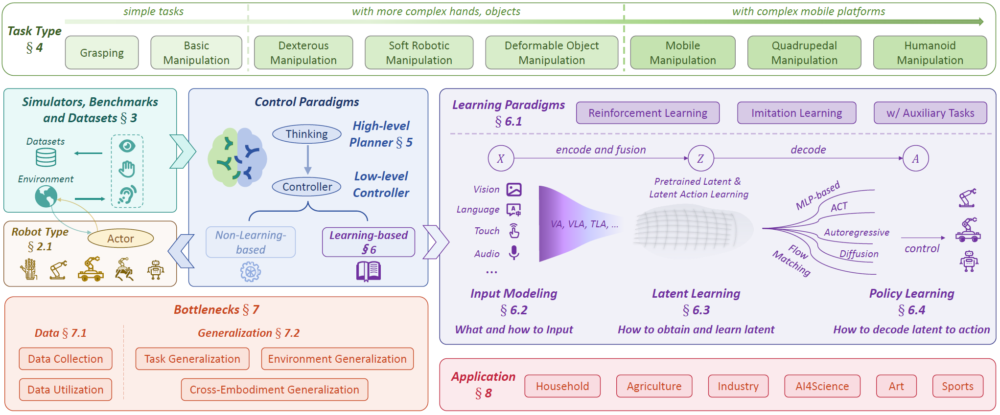

# Awesome-Robotics-Manipulation

## ✨ About

This repository curates research papers on robot manipulation, featuring a smaller collection of non-learning control methods and a larger body of learning-based approaches.

This repository will be continuously updated, and we warmly welcome contributions from the community. If you have papers, projects, or resources that are not yet included, please feel free to submit them via a pull request, open an issue for discussion or [email](baishuanghao@stu.xjtu.edu.cn) us to add papers! 

## 📢 News

- **[2025/10]** Our paper [Towards a Unified Understanding of Robot Manipulation: A Comprehensive Survey](https://arxiv.org/abs/2510.10903) is on available! 
- **[2025/08]** Major revision of the classification system with a more refined taxonomy; substantial improvements across all sections.
- **[2025/07]** Expanded coverage of *Dexterous*, *Soft Robotic*, *Mobile*, *Quadrupedal*, and *Humanoid Manipulation*; refined the categorization and content for *Awesome Simulators, Benchmarks, and Datasets*，added non-learning-based control methods.  
- **[2025/06]** Introduced new sections on *Grasp in Cluttered Scenes*, *Quadrupedal and Humanoid Manipulation*, and *Learning from Human Demonstrations*. Also improved the classification of the *Applications* section and added a subsection on *Embodied QA Datasets*.  
- **[2025/02]** Added a new section on *Bimanual Grasp*.  
- **[2024/12]** Introduced coverage of *Dexterous Grasp*.  
- **[2024/10]** Repository is now public!

<details>
Stay tuned for updates to this comprehensive survey!

<summary>Summary of Survey</summary>


   
</details>

<!-- ------- 0 - Content Table ------- -->
<h2 id="table-of-contents">🏠 Table of Contents</h2>

- [📝 Awesome Papers](#-awesome-papers)
  - [📄 Survey](#-survey)
  - [Manipulation Tasks](contents/manipulation_tasks.md)
    - [Grasp](contents/manipulation_tasks.md#grasp)
    - [Basic Manipulation](contents/manipulation_tasks.md#basic-manipulation)
    - [Dexterous Manipulation](contents/manipulation_tasks.md#dexterous-manipulation)
    - [Soft Robotic Manipulation](contents/manipulation_tasks.md#soft-robotic-manipulation)
    - [Deformable Object Manipulation](contents/manipulation_tasks.md#deformable-object-manipulation)
    - [Mobile Manipulation](contents/manipulation_tasks.md#mobile-manipulation)
    - [Quadrupedal Manipulation](contents/manipulation_tasks.md#quadrupedal-manipulation)
    - [Humanoid Manipulation](contents/manipulation_tasks.md#humanoid-manipulation)
  - [High-level Planner](contents/high-level_planner.md)
    - [Task Planning](contents/high-level_planner.md#task-planning)
    - [Code Generation](contents/high-level_planner.md#code-generation)
    - [Multimodal Reasoning](contents/high-level_planner.md#multimodal-reasoning)
    - [Motion Planning](contents/high-level_planner.md#motion-planning)
    - [Affordance Learning](contents/high-level_planner.md#affordance-learning)
    - [3D Representation as Planner](contents/high-level_planner.md#3d-representation-as-planner)
  - [Low-level Learning-based Control Methods](contents/low-level_learning-based_control.md)
    - [Learning Strategy](contents/low-level_learning-based_control.md#learning-strategy)
      - [Imitation Learning (IL)](contents/low-level_learning-based_control.md#imitation-learning-il)
      - [Reinforcement Learning (RL)](contents/low-level_learning-based_control.md#reinforcement-learning-rl)
      - [RL and IL](contents/low-level_learning-based_control.md#rl-and-il)
      - [Learning with Auxiliary Tasks](contents/low-level_learning-based_control.md#learning-with-auxiliary-tasks)
    - [Input Modality](contents/low-level_learning-based_control.md#modality)
      - [Vision Action Models](contents/low-level_learning-based_control.md#vision-action-models)
      - [Vision Language Action Models](contents/low-level_learning-based_control.md#vision-language-action-models)
      - [Tactile-based Action Models](contents/low-level_learning-based_control.md#tactile-based-action-models)
      - [Other Modalities](contents/low-level_learning-based_control.md#other-modalities)
    - [Latent Learning](contents/low-level_learning-based_control.md#latent-learning)
      - [Pretrained Latent Learning](contents/low-level_learning-based_control.md#pretrained-latent-learning)
      - [Latent Action Learning](contents/low-level_learning-based_control.md#latent-action-learning)
    - [Policy Learning](contents/low-level_learning-based_control.md#latent-decode-policy-design)
      - [Diffusion Policy](contents/low-level_learning-based_control.md#diffusion-policy)
      - [Other Policies](contents/low-level_learning-based_control.md#other-policies)
  - [Bottlenecks](contents/bottlenecks.md)
    - [Data Collection and Utilization](contents/bottlenecks.md#data-collection-and-utilization)
        - [Data Collection](contents/bottlenecks.md#data-collection)
        - [Data Utilization](contents/bottlenecks.md#data-utilization)
    - [Generalization](contents/bottlenecks.md#generalization)
      - [Task Generalization](contents/bottlenecks.md#task-generalization)
      - [Environment Generalization](contents/bottlenecks.md#environment-generalization)
      - [Cross-Embodiment Generalization](contents/bottlenecks.md#cross-embodiment-generalization)
  - [Applications](contents/applications.md)
- [📊 Awesome Simulators, Benchmarks and Datasets](#-awesome-simulators-benchmarks-and-dataset)
  - [Grasp Datasets](#grasp-datasets)
  - [Single-Embodiment Manipulation Simulators and Benchmarks](#single-embodiment-manipulation-simulators-and-benchmarks)
  - [Cross-Embodiment Simulators and Benchmarks](#cross-embodiment-simulators-and-benchmarks)
  - [Other Simulators and Benchmarks](#other-simulators-and-benchmarks)
  - [Trajectory Datasets](#trajectory-datasets)
  - [Embodied QA and Affordance Datasets](#embodied-qa-and-affordance-datasets)
- [🛠️ Awesome Techniques](#-awesome-techniques)


<!-- ------- 1 - Papers ------- -->
## 📝 Awesome Papers

<!-- ------- 1.1 - Survey ------- -->
### 📄 Survey
|  Title  |   Venue  |   Date   |   Code   |   Notes  |
|:--------|:--------:|:--------:|:--------:|:--------:|
| _VLA Models_ |
| [**Large VLM-based Vision-Language-Action Models for Robotic Manipulation: A Survey**](https://arxiv.org/abs/2508.13073) | arXiv | 2025-08-23 |  [Github](https://github.com/JiuTian-VL/Large-VLM-based-VLA-for-Robotic-Manipulation) | VLA Models |
| [**Survey of Vision-Language-Action Models for Embodied Manipulation**](https://arxiv.org/abs/2508.15201) | arXiv | 2025-08-21 | - | VLA Models |
| [**Vision Language Action Models in Robotic Manipulation: A Systematic Review**](https://arxiv.org/abs/2507.10672) | arXiv | 2025-07-14 | - | VLA Models |
| [**A Survey on Vision-Language-Action Models: An Action Tokenization Perspective**](https://arxiv.org/abs/2507.01925) | arXiv | 2025-07-02 | - | VLA Models |
| [**Parallels Between VLA Model Post-Training and Human Motor Learning: Progress, Challenges, and Trends**](https://arxiv.org/abs/2506.20966) | arXiv | 2025-05-26 |  [Github](https://github.com/AoqunJin/Awesome-VLA-Post-Training) | VLA Models |
| [**Vision-Language-Action Models: Concepts, Progress, Applications and Challenges**](https://arxiv.org/abs/2505.04769) | arXiv | 2025-05-07 | - | VLA Models |
| [**A Survey on Vision-Language-Action Models for Embodied AI**](https://arxiv.org/abs/2405.14093) | arXiv | 2024-05-23 | - | VLA Models |
| _Dexterous Manipulation_ |
| [**The Developments and Challenges towards Dexterous and Embodied Robotic Manipulation: A Survey**](https://arxiv.org/abs/2507.11840) | arXiv | 2025-07-16 | - | Dexterous Manipulation |
| [**Interactive Imitation Learning for Dexterous Robotic Manipulation: Challenges and Perspectives -- A Survey**](https://arxiv.org/abs/2506.00098) | arXiv | 2025-06-30 | - | Dexterous Manipulation |
| [**Dexterous Manipulation through Imitation Learning: A Survey**](https://arxiv.org/abs/2504.03515) | arXiv | 2025-04-04 | - | Dexterous Manipulation |
| _Deformable Object Manipulation (DOM)_ |
| [**T-DOM: A Taxonomy for Robotic Manipulation of Deformable Objects**](https://arxiv.org/abs/2412.20998) | arXiv | 2024-12-30 | [Project](https://sites.google.com/view/t-dom) | DOM |
| [**A Survey on Robotic Manipulation of Deformable Objects: Recent Advances, Open Challenges and New Frontiers**](https://arxiv.org/abs/2312.10419) | arXiv | 2023-12-16 | - | DOM |
| [**Robotic manipulation and sensing of deformable objects in domestic and industrial applications: a survey**](https://uca.hal.science/hal-01816189/document) | IJRR 2018 | 2018-06-13 | - | DOM |
| _Humanoid Manipulation_ |
| [**Humanoid Locomotion and Manipulation: Current Progress and Challenges in Control, Planning, and Learning**](https://arxiv.org/abs/2501.02116) | arXiv | 2025-01-03 | - | Humanoid Manipulation |
| [**Teleoperation of Humanoid Robots: A Survey**](https://arxiv.org/abs/2301.04317) | T-RO 2024 | 2023-01-11 | [Project](https://humanoid-teleoperation.github.io/) | Humanoid |
| _Others_ |
| [**A Survey of Robotic Navigation and Manipulation with Physics Simulators in the Era of Embodied AI**](https://arxiv.org/abs/2505.01458) | arXiv | 2025-05-01 | - | Navigation and Manipulation |
| [**Diffusion Models for Robotic Manipulation: A Survey**](https://arxiv.org/abs/2504.08438) | arXiv | 2025-04-11 | - | Manipulation + DP |
| [**Multimodal Fusion and Vision-Language Models: A Survey for Robot Vision**](https://arxiv.org/abs/2504.02477) | arXiv | 2025-04-03 |  [Github](https://github.com/Xiaofeng-Han-Res/MF-RV) | Robot Vision |
| [**Generative Artificial Intelligence in Robotic Manipulation: A Survey**](https://arxiv.org/abs/2503.03464) | arXiv | 2025-03-05 |  [Github](https://github.com/GAI4Manipulation/AwesomeGAIManipulation) | Manipulation + Generative Models |
| [**A Survey of Embodied Learning for Object-Centric Robotic Manipulation**](https://arxiv.org/abs/2408.11537) | MIR 2025 | 2024-08-21 |  [Github](https://github.com/RayYoh/OCRM_survey) | Manipulation + Object-Centric |
| [**Aligning Cyber Space with Physical World: A Comprehensive Survey on Embodied AI**](https://arxiv.org/abs/2407.06886) | arXiv | 2024-07-09 |  [Github](https://github.com/HCPLab-SYSU/Embodied_AI_Paper_List) | Embodied Agent |
| [**Survey of Learning-based Approaches for Robotic In-Hand Manipulation**](https://arxiv.org/abs/2401.07915) | arXiv | 2024-01-15 | - | In-hand Manipulation |
| [**Language-conditioned Learning for Robotic Manipulation: A Survey**](https://arxiv.org/abs/2312.10807) | arXiv | 2023-12-17 |  [Github](https://github.com/hk-zh/language-conditioned-robot-manipulation-models) | Manipulation |
| [**Deep Learning Approaches to Grasp Synthesis: A Review**](https://arxiv.org/abs/2207.02556) | T-RO 2023 | 2023-07-06 | [Project](https://rhys-newbury.github.io/projects/6dof/) | Grasp |
| [**A Survey of Wheeled Mobile Manipulation: A Decision Making Perspective**](https://par.nsf.gov/servlets/purl/10393722) | J. Mech. Robot. 2023 | 2023-04 | - | Mobile Manipulation |
| [**A Review of Soft Manipulator Research, Applications, and Opportunities**](https://onlinelibrary.wiley.com/doi/abs/10.1002/rob.22051) | J Field Robot. 2023 | 2023-04 | - | Soft Manipulator |

<p align="right">(<a href="#table-of-contents">back to top</a>)</p>

<!-- ------- 1.2 - Future Direction ------- -->
<!-- ### Future Direction
<!-- |  Title  |   Venue  |   Date   |   Code   | 
|:--------|:--------:|:--------:|:--------:|
| [**Federated Learning for Large-Scale Cloud Robotic Manipulation: Opportunities and Challenges**](https://www.arxiv.org/abs/2507.17903) | ICMLC 2025 | 2025-07-23 | - | | --> 

> **Note:** Other papers are **summarized** in the [**Contents**](contents/).


<!-- ------- 2 - Benchmarks ------- -->
## 📊 Awesome Simulators, Benchmarks and Dataset

<!-- ------- 2.1 - Grasp Datasets ------- -->
### Grasp Datasets
<!-- |  Title  |   Venue  |   Date   |   Code   |   Notes  |
|:--------|:--------:|:--------:|:--------:|:--------:| -->
|  Title  |   Venue  |   Date   |   Code   | 
|:--------|:--------:|:--------:|:--------:|
| _Rectangle-based Grasp_ |
| [Grasp-Anything-6D: **Language-Driven 6-DoF Grasp Detection Using Negative Prompt Guidance**](https://arxiv.org/abs/2407.13842) | ECCV 2024 | 2024-07-18 |  [Github](https://github.com/Fsoft-AIC/Language-Driven-6-DoF-Grasp-Detection-Using-Negative-Prompt-Guidance) |  |
| [Grasp-Anything++: **Language-driven Grasp Detection**](https://arxiv.org/abs/2406.09489) | CVPR 2024 | 2024-06-13 |  [Github](https://github.com/Fsoft-AIC/LGD) |  |
| [**Grasp-Anything: Large-scale Grasp Dataset from Foundation Models**](https://arxiv.org/abs/2309.09818) | ICRA 2024 | 2023-09-18 |  [Github](https://github.com/Fsoft-AIC/Grasp-Anything) | |
| [**REGRAD: A Large-Scale Relational Grasp Dataset for Safe and Object-Specific Robotic Grasping in Clutter**](https://arxiv.org/abs/2104.14118) | ICRA 2021 | 2021-04-29 |  [Github](https://github.com/poisonwine/REGRAD) | |
| [**Jacquard: A Large Scale Dataset for Robotic Grasp Detection**](https://arxiv.org/abs/1803.11469) | IROS 2018 | 2018-03-30 | [Project](https://jacquard.liris.cnrs.fr/) | |
| [Cornell: **Efficient Grasping from RGBD Images: Learning Using a New Rectangle Representation**](https://ieeexplore.ieee.org/document/5980145) | ICRA 2011 | 2011-08 | - | |
| _6-DoF Grasp_ |
| [**GraspFactory: A Large Object-Centric Grasping Dataset**](https://arxiv.org/abs/2509.20550) | CoRLW 2025 | 2025-09-24 |  [Github](https://github.com/AutodeskRoboticsLab/graspfactory) | |
| [**MapleGrasp: Mask-guided Feature Pooling for Language-driven Efficient Robotic Grasping**](https://arxiv.org/abs/2506.06535) | arXiv | 2025-06-06 | - | |
| [**GraspClutter6D: A Large-scale Real-world Dataset for Robust Perception and Grasping in Cluttered Scenes**](https://arxiv.org/abs/2504.06866) | arXiv | 2025-04-09 | [Project](https://sites.google.com/view/graspclutter6d) | |
| [**QDGset: A Large Scale Grasping Dataset Generated with Quality-Diversity**](https://arxiv.org/abs/2410.02319) | arXiv | 2024-10-03 | [Project](https://github.com/qdgrasp/qdgrasp.github.io/blob/main/qdg_set.md) | |
| [**Real-to-Sim Grasp: Rethinking the Gap between Simulation and Real World in Grasp Detection**](https://arxiv.org/abs/2410.06521) | CoRL 2024 | 2024-10-09 | [Project](https://isee-laboratory.github.io/R2SGrasp/) | |
| [**MetaGraspNetV2: All-in-One Dataset Enabling Fast and Reliable Robotic Bin Picking via Object Relationship Reasoning and Dexterous Grasping**](https://ieeexplore.ieee.org/document/10309974) | TASE 2023 | 2023-11-06 |  [Github](https://github.com/maximiliangilles/MetaGraspNet) | |
| [**MetaGraspNet: A Large-Scale Benchmark Dataset for Scene-Aware Ambidextrous Bin Picking via Physics-based Metaverse Synthesis**](https://arxiv.org/abs/2208.03963) | CASE 2022 | 2022-08-08 |  [Github](https://github.com/maximiliangilles/MetaGraspNet) | |
| [**ACRONYM: A Large-Scale Grasp Dataset Based on Simulation**](https://arxiv.org/abs/2011.09584) | ICRA 2021 | 2020-11-18 |  [Github](https://github.com/NVlabs/acronym) | |
| [**GraspNet-1Billion: A Large-Scale Benchmark for General Object Grasping**](https://openaccess.thecvf.com/content_CVPR_2020/papers/Fang_GraspNet-1Billion_A_Large-Scale_Benchmark_for_General_Object_Grasping_CVPR_2020_paper.pdf) | CVPR 2020 | 2020-08-05 |  [Github](https://github.com/graspnet/graspnet-baseline) | |
| _Dexterous Grasp_ |
| [**Dex1B: Learning with 1B Demonstrations for Dexterous Manipulation**](https://arxiv.org/abs/2506.17198) | RSS 2025 | 2025-06-20 | [Project](https://jianglongye.com/dex1b/) | |
| [**DexGraspNet 2.0: Learning Generative Dexterous Grasping in Large-scale Synthetic Cluttered Scenes**](https://openreview.net/attachment?id=5W0iZR9J7h&name=pdf) | CoRL 2024 | 2024 |  [Github](https://github.com/PKU-EPIC/DexGraspNet2)  |
| [**UniFucGrasp: Human-Hand-Inspired Unified Functional Grasp Annotation Strategy and Dataset for Diverse Dexterous Hands**](https://www.arxiv.org/abs/2508.03339) | arXiv | 2025-08-05 |  [Github](https://github.com/cxcAxxy/UniFucGrasp) | |
| [**DexGraspNet: A Large-Scale Robotic Dexterous Grasp Dataset for General Objects Based on Simulation**](https://arxiv.org/abs/2210.02697) | ICRA 2023 | 2022-10-06 |  [Github](https://github.com/PKU-EPIC/DexGraspNet) | |

<p align="right">(<a href="#table-of-contents">back to top</a>)</p>

<!-- ------- 2.2 - Single-Embodiment Manipulation Simulators and Benchmarks ------- -->
### Single-Embodiment Manipulation Simulators and Benchmarks
<!-- |  Title  |   Venue  |   Date   |   Code   |   Notes  |
|:--------|:--------:|:--------:|:--------:|:--------:| -->
|  Title  |   Venue  |   Date   |   Code   | 
|:--------|:--------:|:--------:|:--------:|
| _Basic Manipulation with a Single Arm_ |
| [**SRMP: Search-Based Robot Motion Planning Library**](https://arxiv.org/abs/2509.25352) | arXiv | 2025-09-29 | [Project](https://srmp.readthedocs.io/en/latest/) | |
| [**Robot Control Stack: A Lean Ecosystem for Robot Learning at Scale**](https://arxiv.org/abs/2509.14932) | arXiv | 2025-09-18 |  [Github](https://github.com/RobotControlStack/robot-control-stack) | For VLA |
| [**LADEV: A Language-Driven Testing and Evaluation Platform for Vision-Language-Action Models in Robotic Manipulation**](https://arxiv.org/abs/2410.05191) | arXiv | 2024-10-07 | - | For VLA |
| [**RoboCAS: A Benchmark for Robotic Manipulation in Complex Object Arrangement Scenarios**](https://arxiv.org/abs/2407.06951) | arXiv | 2024-07-09 |  [Github](https://github.com/notFoundThisPerson/RoboCAS-v0) |
| [**GenSim2: Scaling Robot Data Generation with Multi-modal and Reasoning LLMs**](https://arxiv.org/abs/2410.03645) | CoRL 2024 | 2024-10-04 |  [Github](https://github.com/GenSim2/gensim2) |
| [**FetchBench: A Simulation Benchmark for Robot Fetching**](https://arxiv.org/abs/2406.11793) | CoRL 2024 | 2024-06-17 |  [Github](https://github.com/princeton-vl/FetchBench-CORL2024) |  |
| [SIMPLER: **Evaluating Real-World Robot Manipulation Policies in Simulation**](https://arxiv.org/abs/2405.05941) | CoRL 2024 | 2024-05-09 |  [Github](https://github.com/simpler-env/SimplerEnv) | For VLA |
| [**Towards Diverse Behaviors: A Benchmark for Imitation Learning with Human Demonstrations**](https://arxiv.org/abs/2402.14606) | ICLR 2024 | 2024-02-22 |  [Github](https://github.com/ALRhub/d3il) | |
| [**LIBERO: Benchmarking Knowledge Transfer for Lifelong Robot Learning**](https://arxiv.org/abs/2306.03310) | NeurIPS 2023 | 2023-06-05 |  [Github](https://github.com/Lifelong-Robot-Learning/LIBERO) | |
| [**ARNOLD: A Benchmark for Language-Grounded Task Learning With Continuous States in Realistic 3D Scenes**](https://arxiv.org/abs/2304.04321) | ICCV 2023 | 2023-04-09 |  [Github](https://github.com/arnold-benchmark/arnold) | |
| [**VIMA: General Robot Manipulation with Multimodal Prompts**](https://arxiv.org/abs/2210.03094) | ICML 2023 | 2022-10-06 |  [Github](https://github.com/vimalabs/VIMA) | |
| [**ManiSkill2: A Unified Benchmark for Generalizable Manipulation Skills**](https://arxiv.org/abs/2302.04659) | ICLR 2023 | 2023-02-09 |  [Github](https://github.com/haosulab/ManiSkill2) | |
| [**Perceiver-Actor: A Multi-Task Transformer for Robotic Manipulation**](https://arxiv.org/abs/2209.05451) | CoRL 2022 | 2022-11-11 |  [Github](https://github.com/peract/peract) | |
| [**VLMbench: A Compositional Benchmark for Vision-and-Language Manipulation**](https://arxiv.org/abs/2206.08522) | NeurIPS 2022 | 2022-06-17 |  [Github](https://github.com/eric-ai-lab/VLMbench) | |
| [**ManiSkill: Generalizable Manipulation Skill Benchmark with Large-Scale Demonstrations**](https://arxiv.org/abs/2107.14483) | NeurIPS D&B 2021 | 2021-07-30 |  [Github](https://github.com/haosulab/ManiSkill) | |
| [Robomimic: **What Matters in Learning from Offline Human Demonstrations for Robot Manipulation**](https://arxiv.org/abs/2108.03298) | CoRL 2021 | 2021-08-06 |  [Github](https://github.com/ARISE-Initiative/robomimic) | |
| [**RLBench: The Robot Learning Benchmark & Learning Environment**](https://arxiv.org/abs/1909.12271) | RA-L 2020 | 2019-09-26 |  [Github](https://github.com/stepjam/RLBench) | |
| [Franka-Kitchen: **Relay Policy Learning: Solving Long-Horizon Tasks via Imitation and Reinforcement Learning**](https://arxiv.org/abs/1910.11956) | CoRL 2019 | 2019-10-25 | [Project](https://relay-policy-learning.github.io/) |
| [**Meta-World: A Benchmark and Evaluation for Multi-Task and Meta Reinforcement Learning**](https://arxiv.org/abs/1910.10897) | CoRL 2019 | 2019-10-24 |  [Github](https://github.com/Farama-Foundation/Metaworld) |
| _Basic Manipulation with Bimanual Arms_ |
| [**RoboEval: Where Robotic Manipulation Meets Structured and Scalable Evaluation**](https://arxiv.org/abs/2507.00435) | arXiv | 2025-07-01 |  [Github](https://github.com/Robo-Eval/RoboEval) | |
| [**RoboTwin 2.0: A Scalable Data Generator and Benchmark with Strong Domain Randomization for Robust Bimanual Robotic Manipulation**](https://arxiv.org/abs/2506.18088) | arXiv | 2025-06-22 |  [Github](https://github.com/robotwin-Platform/RoboTwin) | |
| [**RoboTwin: Dual-Arm Robot Benchmark with Generative Digital Twins**](https://arxiv.org/abs/2504.13059) | CVPR 2025 | 2025-04-17 |  [Github](https://github.com/TianxingChen/RoboTwin) | |
| [**PerAct2: Benchmarking and Learning for Robotic Bimanual Manipulation Tasks**](https://arxiv.org/abs/2407.00278) | CoRLW 2024 | 2024-07-29 |  [Github](https://github.com/markusgrotz/peract_bimanual) | |
| _Basic Manipulation with Long-horizon Tasks_ |
| [**RoboCerebra: A Large-scale Benchmark for Long-horizon Robotic Manipulation Evaluation**](https://arxiv.org/abs/2506.06677) | arXiv | 2025-06-07 | [Project](https://robocerebra.github.io/) | |
| [**MuBlE: MuJoCo and Blender simulation Environment and Benchmark for Task Planning in Robot Manipulation**](https://arxiv.org/abs/2503.02834) | arXiv | 2025-03-03 |  [Github](https://github.com/michaal94/MuBlE) | |
| [**VLABench: A Large-Scale Benchmark for Language-Conditioned Robotics Manipulation with Long-Horizon Reasoning Tasks**](https://arxiv.org/abs/2412.18194) | arXiv | 2024-12-24 |  [Github](https://github.com/OpenMOSS/VLABench) | |
| [**FurnitureBench: Reproducible Real-World Benchmark for Long-Horizon Complex Manipulation**](https://arxiv.org/abs/2305.12821) | RSS 2023 | 2023-05-22 |  [Github](https://github.com/clvrai/furniture-bench) | |
| [**CALVIN: A Benchmark for Language-Conditioned Policy Learning for Long-Horizon Robot Manipulation Tasks**](https://arxiv.org/abs/2112.03227) | RA-L 2022 | 2021-12-06 |  [Github](https://github.com/mees/calvin) | |
| [**Panda-gym: Open-source Goal-conditioned Environments for Robotic Learning**](https://arxiv.org/abs/2106.13687) | NeurIPSW 2021 | 2021-06-25 |  [Github](https://github.com/qgallouedec/panda-gym) | |
| [**IKEA Furniture Assembly Environment for Long-Horizon Complex Manipulation Tasks**](https://arxiv.org/abs/1911.07246) | ICRA 2021 | 2019-11-17 |  [Github](https://github.com/clvrai/furniture) | |
| _Basic Manipulation with Generalization Tasks_ |
| [INT-ACT: **From Intention to Execution: Probing the Generalization Boundaries of Vision-Language-Action Models**](https://arxiv.org/abs/2506.09930) | arXiv | 2025-06-11 |  [Github](https://github.com/ai4ce/INT-ACT) | |
| [AGNOSTOS: **Exploring the Limits of Vision-Language-Action Manipulations in Cross-task Generalization**](https://arxiv.org/abs/2505.15660) | arXiv | 2025-05-21 |  [Github](https://github.com/jiaming-zhou/X-ICM) | |
| [Gembench: **Towards Generalizable Vision-Language Robotic Manipulation: A Benchmark and LLM-guided 3D Policy**](https://arxiv.org/abs/2410.01345) | ICRA 2025 | 2024-10-02 |  [Github](https://github.com/vlc-robot/robot-3dlotus) | |
| [**THE COLOSSEUM: A Benchmark for Evaluating Generalization for Robotic Manipulation**](https://arxiv.org/abs/2402.08191) | RSSW 2024 | 2024-02-13 |  [Github](https://github.com/robot-colosseum/robot-colosseum) | |
| [**KitchenShift: Evaluating Zero-Shot Generalization of Imitation-Based Policy Learning Under Domain Shifts**](https://openreview.net/pdf?id=DdglKo8hBq0) | NeurIPSW 2021 | 2021 |  [Github](https://github.com/etaoxing/kitchen-shift) |
| _Basic Manipulation in Real World_ |
| [**AutoEval: Autonomous Evaluation of Generalist Robot Manipulation Policies in the Real World**](https://arxiv.org/pdf/2503.24278) | arXiv | 2025-03-31 |  [Github](https://github.com/zhouzypaul/auto_eval) | |
| _Basic Manipulation with High-level Planner_ |
| [**GENMANIP: LLM-driven Simulation for Generalizable Instruction-Following Manipulation**](https://arxiv.org/abs/2506.10966) | CVPR 2025 | 2025-06-12 |  [Github](https://github.com/OpenRobotLab/GenManip) | |
| [**ALFRED: A Benchmark for Interpreting Grounded Instructions for Everyday Tasks**](https://arxiv.org/abs/1912.01734) | CVPR 2020 | 2019-12-03 |  [Github](https://github.com/askforalfred/alfred) | |
| _Basic Manipulation with Tactile Representations_ |
| [**ManiFeel: Benchmarking and Understanding Visuotactile Manipulation Policy Learning**](https://arxiv.org/abs/2505.18472) | arXiv | 2025-05-24 | [Project](https://zhengtongxu.github.io/manifeel-website/) | |
| [**TacCompress: A Benchmark for Multi-Point Tactile Data Compression in Dexterous Manipulation**](https://arxiv.org/abs/2505.16289) | arXiv | 2025-05-22 | - | |
| [**TacSL: A Library for Visuotactile Sensor Simulation and Learning**](https://arxiv.org/abs/2408.06506) | T-RO 2025 | 2024-08-12 |  [Github](https://github.com/isaac-sim/IsaacGymEnvs/blob/tacsl/isaacgymenvs/tacsl_sensors/install/tacsl_setup.md) | |
| [**Efficient Tactile Simulation with Differentiability for Robotic Manipulation**](https://openreview.net/pdf?id=6BIffCl6gsM) | CoRL 2022 | 2022-09-10 |  [Github](https://github.com/eanswer/TactileSimulation) | |
| _Dexterous Manipulation_ |
| [**TriFinger: An Open-Source Robot for Learning Dexterity**](https://arxiv.org/abs/2008.03596) | CoRL 2021 | 2020-08-08 |  [Github](https://github.com/open-dynamic-robot-initiative/trifinger_simulation) | |
| [**Learning Complex Dexterous Manipulation with Deep Reinforcement Learning and Demonstrations**](https://arxiv.org/abs/1709.10087) | RSS 2018 | 2017-09-28 |  [Github](https://github.com/aravindr93/hand_dapg) | |
| _Deformable Object Manipulation_ |
| [**MoDeSuite: Robot Learning Task Suite for Benchmarking Mobile Manipulation with Deformable Objects**](https://arxiv.org/abs/2507.21796) | arXiv | 2025-07-29 | [Project](https://sites.google.com/view/modesuite/home) |
| [**DaXBench: Benchmarking Deformable Object Manipulation with Differentiable Physics**](https://arxiv.org/abs/2210.13066) | ICLR 2023 | 2022-10-24 |  [Github](https://github.com/AdaCompNUS/DaXBench) | |
| [**PlasticineLab: A Soft-Body Manipulation Benchmark with Differentiable Physics**](https://arxiv.org/abs/2104.03311) | ICLR 2021 | 2021-04-07 |  [Github](https://github.com/hzaskywalker/PlasticineLab) | |
| [**SoftGym: Benchmarking Deep Reinforcement Learning for Deformable Object Manipulation**](https://arxiv.org/abs/2011.07215) | CoRL 2020 | 2020-11-14 |  [Github](https://github.com/Xingyu-Lin/softgym) | |
| _Mobile Manipulation_ |
| [**Mind and Motion Aligned: A Joint Evaluation IsaacSim Benchmark for Task Planning and Low-Level Policies in Mobile Manipulation**](https://arxiv.org/abs/2508.15663) | arXiv | 2023-08-21 | - | |
| [**CleanUpBench: Embodied Sweeping and Grasping Benchmark**](https://www.arxiv.org/abs/2508.05543) | arXiv | 2023-08-07 | - | |
| [**HomeRobot: Open-Vocabulary Mobile Manipulation**](https://arxiv.org/abs/2306.11565) | CoRL 2023 | 2023-06-20 |  [Github](https://github.com/facebookresearch/home-robot) | |
| [**BEHAVIOR-1K: A Human-Centered, Embodied AI Benchmark with 1,000 Everyday Activities and Realistic Simulation**](https://arxiv.org/abs/2403.09227) | CoRL 2022 | 2024-03-14 | [Project](https://behavior.stanford.edu/) | |
| [**ManipulaTHOR: A Framework for Visual Object Manipulation**](https://arxiv.org/abs/2104.11213) | CVPR 2021 | 2021-04-22 |  [Github](https://github.com/allenai/manipulathor) | |
| _Quadrupedal Manipulation_ |
| [**ODYSSEY: Open-World Quadrupeds Exploration and Manipulation for Long-Horizon Tasks**](https://arxiv.org/abs/2508.08240) | arXiv | 2025-08-11 | [Project](https://kaijwang.github.io/odyssey.github.io/) | |
| _Humanoid Manipulation_ |
| [**HumanoidGen: Data Generation for Bimanual Dexterous Manipulation via LLM Reasoning**](https://arxiv.org/abs/2507.00833) | arXiv | 2025-07-01 |  [Github](https://github.com/TeleHuman/HumanoidGen) | |
| [**BiGym: A Demo-Driven Mobile Bi-Manual Manipulation Benchmark**](https://arxiv.org/abs/2407.07788) | arXiv | 2024-07-10 |  [Github](https://github.com/chernyadev/bigym) | |
| [**HumanoidBench: Simulated Humanoid Benchmark for Whole-Body Locomotion and Manipulation**](https://arxiv.org/abs/2403.10506) | arXiv | 2024-03-15 |  [Github](https://github.com/carlosferrazza/humanoid-bench) | |

<p align="right">(<a href="#table-of-contents">back to top</a>)</p>

<!-- ------- 2.3 - Cross-Embodiment Simulators and Benchmarks ------- -->
### Cross-Embodiment Simulators and Benchmarks
<!-- |  Title  |   Venue  |   Date   |   Code   |   Notes  |
|:--------|:--------:|:--------:|:--------:|:--------:| -->
|  Title  |   Venue  |   Date   |   Code   | 
|:--------|:--------:|:--------:|:--------:|
| [**AgentWorld: An Interactive Simulation Platform for Scene Construction and Mobile Robotic Manipulation**](https://arxiv.org/abs/2508.07770) | CoRL 2025 | 2025-08-11 |  [Github](https://github.com/yizhengzhang1/agent_world) |
| [**VIKI-R: Coordinating Embodied Multi-Agent Cooperation via Reinforcement Learning**](https://arxiv.org/abs/2506.09049) | arXiv | 2025-06-10 |  [Github](https://github.com/MARS-EAI/VIKI-R) |
| [**ImagineBench: Evaluating Reinforcement Learning with Large Language Model Rollouts**](https://arxiv.org/abs/2505.10010) | arXiv | 2025-05-15 |  [Github](https://github.com/LAMDA-RL/ImagineBench) |
| [**RoboVerse: Towards a Unified Platform, Dataset and Benchmark for Scalable and Generalizable Robot Learning**](https://arxiv.org/abs/2504.18904) | RSS 2025 | 2025-04-26 |  [Github](https://github.com/RoboVerseOrg/RoboVerse) |
| [**ManiSkill3: GPU Parallelized Robotics Simulation and Rendering for Generalizable Embodied AI**](https://arxiv.org/abs/2410.00425) | RSS 2025 | 2024-10-01 |  [Github](https://github.com/haosulab/ManiSkill) |
| **GENESIS: A generative world for general-purpose robotics & embodied AI learning** | - | 2024-12 |  [Github](https://github.com/Genesis-Embodied-AI/Genesis) |
| [**RoboCasa: Large-Scale Simulation of Everyday Tasks for Generalist Robots**](https://arxiv.org/abs/2406.02523) | RSS 2024 | 2024-06-04 |  [Github](https://github.com/robocasa/robocasa) |  |
| [**LocoMuJoCo: A Comprehensive Imitation Learning Benchmark for Locomotion**](https://arxiv.org/abs/2311.02496) | NeurIPSW 2023 | 2023-11-04 |  [Github](https://github.com/robfiras/loco-mujoco) | |
| [**RoboHive: A Unified Framework for Robot Learning**](https://arxiv.org/abs/2310.06828) | NeurIPS D&B 2023 | 2023-10-10 |  [Github](https://github.com/vikashplus/robohive) | |
| [CortexBench: **Where are we in the search for an Artificial Visual Cortex for Embodied Intelligence?**](https://arxiv.org/abs/2303.18240) | NeurIPS 2023 | 2023-03-31 |  [Github](https://github.com/facebookresearch/eai-vc) | |
| [Isaac Lab: **Orbit: A Unified Simulation Framework for Interactive Robot Learning Environments**](https://arxiv.org/abs/2301.04195) | RA-L 2023 | 2023-01-10 |  [Github](https://github.com/isaac-sim/IsaacLab) |
| [**robosuite: A Modular Simulation Framework and Benchmark for Robot Learning**](https://arxiv.org/abs/2009.12293) | arXiv | 2020-09-25 |  [Github](https://github.com/ARISE-Initiative/robosuite) |

<p align="right">(<a href="#table-of-contents">back to top</a>)</p>

<!-- ------- 2.4 - Other Simulators and Benchmarks ------- -->
### Other Simulators and Benchmarks
|  Title  |   Venue  |   Date   |   Code   | 
|:--------|:--------:|:--------:|:--------:|
| [**Space Robotics Bench: Robot Learning Beyond Earth**](https://arxiv.org/abs/2509.23328) | arXiv | 2025-09-27 |  [Github](https://github.com/AndrejOrsula/space_robotics_bench) | |
| [**FLAME: A Federated Learning Benchmark for Robotic Manipulation**](https://arxiv.org/abs/2503.01729) | arXiv | 2025-03-03 | - | |
| [**Two by Two: Learning Multi-Task Pairwise Objects Assembly for Generalizable Robot Manipulation**](https://arxiv.org/abs/2504.06961) | CVPR 2025 | 2025-04-09 |  [Github](https://github.com/TEA-Lab/TwoByTWo) | |
| [**FMB: a Functional Manipulation Benchmark for Generalizable Robotic Learning**](https://arxiv.org/abs/2401.08553) | IJRR 2024 | 2024-01-16 |  [Github](https://github.com/rail-berkeley/fmb) | Functional Manipulation |

<p align="right">(<a href="#table-of-contents">back to top</a>)</p>

<!-- ------- 2.5 - Trajectory Datasets ------- -->
### Trajectory Datasets
|  Title  |   Venue  |   Date   |   Code   | 
|:--------|:--------:|:--------:|:--------:|
| [**AIRoA MoMa Dataset: A Large-Scale Hierarchical Dataset for Mobile Manipulation**](https://arxiv.org/abs/2509.25032) | arXiv | 2024-09-29 | [Dataset](https://huggingface.co/datasets/airoa-org/airoa-moma) | |
| [**RoboFAC: A Comprehensive Framework for Robotic Failure Analysis and Correction**](https://arxiv.org/abs/2505.12224) | arXiv | 2024-05-18 | - | |
| [**AgiBot World Colosseo: A Large-scale Manipulation Platform for Scalable and Intelligent Embodied Systems**](https://arxiv.org/abs/2503.06669) | IROS 2025 | 2025-03-09 |  [Github](https://github.com/OpenDriveLab/AgiBot-World) |
| [**RoboMIND: Benchmark on Multi-embodiment Intelligence Normative Data for Robot Manipulation**](https://arxiv.org/abs/2412.13877) | arXiv | 2024-12-18 |  [Github](https://github.com/x-humanoid-robomind/x-humanoid-robomind.github.io) |
| [ARIO: **All Robots in One: A New Standard and Unified Dataset for Versatile, General-Purpose Embodied Agents**](https://arxiv.org/abs/2408.10899) | arXiv | 2024-08-20 | [Dataset](https://openi.pcl.ac.cn/ARIO/ARIO_Dataset) | |
| [**DROID: A Large-Scale In-The-Wild Robot Manipulation Dataset**](https://arxiv.org/abs/2403.12945) | RSS 2024 | 2024-03-19 |  [Github](https://github.com/droid-dataset/droid_policy_learning) | |
| [**Open X-Embodiment: Robotic Learning Datasets and RT-X Models**](https://arxiv.org/abs/2310.08864) | ICRA 2024 | 2023-10-13 |  [Github](https://github.com/google-deepmind/open_x_embodiment) | |
| [**RoboAgent: Generalization and Efficiency in Robot Manipulation via Semantic Augmentations and Action Chunking**](https://arxiv.org/abs/2309.01918) | ICRA 2024 | 2024-09-05 |  [Github](https://github.com/robopen/roboagent) | |
| [**BridgeData V2: A Dataset for Robot Learning at Scale**](https://arxiv.org/abs/2308.12952) | CoRL 2023 | 2023-08-24 |  [Github](https://github.com/rail-berkeley/bridge_data_v2) | |
| [**RH20T: A Comprehensive Robotic Dataset for Learning Diverse Skills in One-Shot**](https://arxiv.org/abs/2307.00595) | RSSW 2023 | 2023-07-02 | [Project](https://rh20t.github.io/) | |
| [**RT-1: Robotics Transformer for Real-World Control at Scale**](https://arxiv.org/abs/2212.06817) | RSS 2023 | 2022-12-13 | [Dataset](https://console.cloud.google.com/storage/browser/gresearch/rt-1-data-release?inv=1&invt=Ab39vQ) | |
| [**BC-Z: Zero-Shot Task Generalization with Robotic Imitation Learning**](https://arxiv.org/abs/2202.02005) | CoRL 2021 | 2022-02-04 | [Dataset](https://www.kaggle.com/datasets/google/bc-z-robot) | |
| [**Bridge Data: Boosting Generalization of Robotic Skills with Cross-Domain Datasets**](https://arxiv.org/abs/2109.13396) | CoRL 2018 | 2021-09-27 |  [Github](https://github.com/yanlai00/bridge_data_imitation_learning) | |
| [**Multiple Interactions Made Easy (MIME): Large Scale Demonstrations Data for Imitation**](https://arxiv.org/abs/1810.07121) | CoRL 2018 | 2018-10-16 | - | |

<p align="right">(<a href="#table-of-contents">back to top</a>)</p>

<!-- ------- 2.6 - Embodied QA and Affordance Datasets ------- -->
### Embodied QA and Affordance Datasets
|  Title  |   Venue  |   Date   |   Code   | 
|:--------|:--------:|:--------:|:--------:|
| [**Point-It-Out: Benchmarking Embodied Reasoning for Vision Language Models in Multi-Stage Visual Grounding**](https://arxiv.org/abs/2509.25794) | arXiv | 2025-09-30 |  [Github](https://github.com/xavihart/PIO) | |
| [**How Good are Foundation Models in Step-by-Step Embodied Reasoning?**](https://arxiv.org/abs/2509.15293) | arXiv | 2025-09-18 |  [Github](https://github.com/mbzuai-oryx/FoMER-Bench) | |
| [**RoboRefer: Towards Spatial Referring with Reasoning in Vision-Language Models for Robotics**](https://arxiv.org/abs/2506.04308) | NeurIPS 2025 | 2025-06-28 |  [Github](https://github.com/Zhoues/RoboRefer) |  |
| [**OmniEAR: Benchmarking Agent Reasoning in Embodied Tasks**](https://arxiv.org/abs/2508.05614) | arXiv | 2024-08-07 |  [Github](https://github.com/ZJU-REAL/OmniEmbodied) | |
| [**PAC Bench: Do Foundation Models Understand Prerequisites for Executing Manipulation Policies?**](https://arxiv.org/abs/2506.23725) | arXiv | 2024-06-30 | [Project](https://pacbench.github.io/) | |
| [**Robo2VLM: Visual Question Answering from Large-Scale In-the-Wild Robot Manipulation Datasets**](https://arxiv.org/abs/2505.15517) | arXiv | 2024-05-21 | [Huggingface](https://huggingface.co/datasets/keplerccc/Robo2VLM-1) | |
| [**PointArena: Probing Multimodal Grounding Through Language-Guided Pointing**](https://arxiv.org/abs/2505.09990) | arXiv | 2024-05-15 |  [Github](https://github.com/pointarena/pointarena) | |
| [**ManipBench: Benchmarking Vision-Language Models for Low-Level Robot Manipulation**](https://arxiv.org/abs/2505.09698) | arXiv | 2024-05-14 | [Project](https://manipbench.github.io/) | |
| [**ManipVQA: Injecting Robotic Affordance and Physically Grounded Information into Multi-Modal Large Language Models**](https://arxiv.org/abs/2403.11289) | IROS 2024 | 2024-03-17 |  [Github](https://github.com/SiyuanHuang95/ManipVQA) | |
| [**OpenEQA: Embodied Question Answering in the Era of Foundation Models**](https://open-eqa.github.io/assets/pdfs/paper.pdf) | CVPR 2024 | 2024 |  [Github](https://github.com/facebookresearch/open-eqa) | |

<p align="right">(<a href="#table-of-contents">back to top</a>)</p>

<!-- ------- 2.7 - Human and Robotic Video Datasets ------- -->
### Human and Robotic Video Datasets
|  Title  |   Venue  |   Date   |   Code   | 
|:--------|:--------:|:--------:|:--------:|
| [**OmniWorld: A Multi-Domain and Multi-Modal Dataset for 4D World Modeling**](https://arxiv.org/abs/2509.12201) | arXiv | 2024-09-15 |  [Github](https://github.com/yangzhou24/OmniWorld) | |
| [**OpenEgo: A Large-Scale Multimodal Egocentric Dataset for Dexterous Manipulation**](https://arxiv.org/abs/2509.05513) | arXiv | 2024-09-05 |  [Github](https://github.com/physicalinc/openego) | |

<!-- ------- 3 - Techniques ------- -->
## 🛠️ Awesome Techniques
<!-- |  Title  |   Venue  |   Date   |   Code   |   Notes  |
|:--------|:--------:|:--------:|:--------:|:--------:| -->
|  Title  |   Venue  |   Date   |   Code   | 
|:--------|:--------:|:--------:|:--------:|
| **Awesome-Dual-System-VLA: [OpenHelix: A Short Survey, Empirical Analysis, and Open-Source Dual-System VLA Model for Robotic Manipulation](https://arxiv.org/abs/2505.03912)** | - | 2025-05-06 |  [Github](https://github.com/OpenHelix-robot/awesome-dual-system-vla) | |
| **Awesome-Implicit-NeRF-Robotics: [Neural Fields in Robotics: A Survey](https://arxiv.org/abs/2410.20220)** | - | 2024-10-26 |  [Github](https://github.com/zubair-irshad/Awesome-Implicit-NeRF-Robotics) | |
| **Awesome-Robotics-3D** | - | 2024-08-13 |  [Github](https://github.com/zubair-irshad/Awesome-Robotics-3D) | |
| **Awesome-Video-Robotic-Papers** | - | 2024-06-18 |  [Github](https://github.com/H-Freax/Awesome-Video-Robotic-Papers) | |
| **awesome-humanoid-learning** | - | 2024-01-16 |  [Github](https://github.com/jonyzhang2023/awesome-humanoid-learning) | |
| **Awesome-Robotics-Foundation-Models: [Foundation Models in Robotics: Applications, Challenges, and the Future](https://arxiv.org/abs/2312.07843)** | - | 2023-12-13 |  [Github](https://github.com/robotics-survey/Awesome-Robotics-Foundation-Models/tree/main) | |
| **Awesome-Generalist-Robots-via-Foundation-Models: [Neural Fields in Robotics: A Survey](https://arxiv.org/abs/2312.08782)** | - | 2023-06-20 |  [Github](https://github.com/JeffreyYH/Awesome-Generalist-Robots-via-Foundation-Models) | |
| **Awesome-LLM-Robotics** | - | 2022-08-12 |  [Github](https://github.com/GT-RIPL/Awesome-LLM-Robotics) | |

<p align="right">(<a href="#table-of-contents">back to top</a>)</p>


## ✨ Citation

If you find this repository useful, please consider citing our paper:
```
@article{bai2025towards,
  title={Towards a Unified Understanding of Robot Manipulation: A Comprehensive Survey},
  author={Bai, Shuanghao and Song, Wenxuan and Chen, Jiayi and Ji, Yuheng and Zhong, Zhide and Yang, Jin and Zhao, Han and Zhou, Wanqi and Zhao, Wei and Li, Zhe and Ding, Pengxiang and Chi, Cheng and Li, Haoang and Xu, Chang and Zheng, Xiaolong and Wang, Donglin and Zhang, Shanghang and Chen, Badong},
  journal={arXiv preprint arXiv:2510.10903},
  year={2025}
}
```
